# 「教程」Android 微软远程桌面客户端使用自定义分辨率

## 简介

通过远程桌面连接 Windows 时，不能在系统中修改分辨率，只能在连接远程桌面的工具中设置。

对于 Windows 上的“远程桌面连接”工具，可在它的 `显示 - 显示配置` 中修改（只能选择给出的分辨率），也可以在远程桌面配置文件（`.rdp`）中修改（可以设置为任意合适的分辨率）。

而对于 Android 系统上的“RD Client”，只能选择它给出的分辨率（目前还不支持手动输入分辨率数值），且由于给出的分辨率与手机的分辨率相关，在全面屏手机上使用的时候会比较奇怪（例如不能设置为 16:9 的分辨率）。

因此，如果要在 Android 系统的远程桌面使用自定义的分辨率，需要借助外部的工具进行实现。

## 版本信息

系统版本：Android 11

应用程序：Microsoft Remote Desktop 10.0.9.1122

## 实现方式

### 方式一、修改软件数据文件

> 注意：使用此方式需要手机系统有 ROOT 权限。

1. 安装“MiXplorer”应用程序（其他支持修改 SQLite 数据库文件的应用程序也可以）。
2. 在远程桌面客户端“RD Client”的“Display”页面中保存几个任意的分辨率，然后关闭。

    > 注意：需要完全关闭 RD Client（不在后台运行）。
    >

    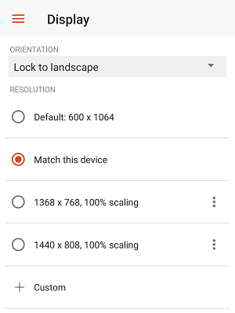
3. 打开安装的 MiXplorer，授予 ROOT 权限。
4. 进入路径 `/data/data/com.microsoft.rdc.androidx/databases`。  
    ​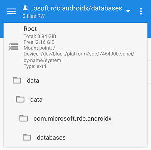
5. 使用 MiXplorer 的“SQLite Editor”工具打开文件夹中的 `RDPConnection.db` 文件。

    > 建议修改前备份 RD Client 的数据，或者备份该文件，以便在修改错误导致 RD Client 无法启动或数据丢失时还原。
    >

    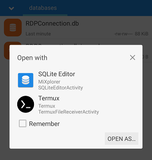
6. 点击左上方的下拉菜单，切换到 `resolution_table` 项。  
    此时可以看到刚刚在 RD Client 中添加的几个分辨率项。  
    ​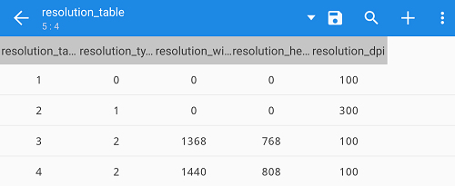
7. 长按需要修改的项进行编辑，点击“UPDATE”保存。  
    ​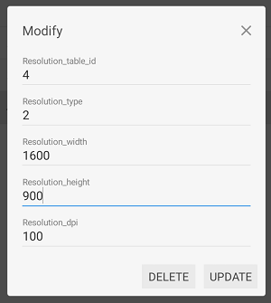
8. 修改完毕后，点击右上方的保存按钮提交修改。  
    ​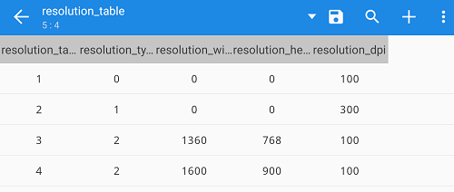  
    ​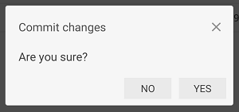
9. 重新打开 RD Client，如果修改成功，分辨率列表会有相应的变化。  
    ​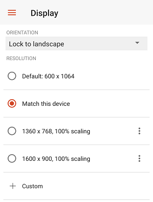

### 方式二、修改手机分辨率

> 注意：  
> 使用此方式需要 ADB 工具。  
> 执行的命令不能有错误，否则可能对系统造成破坏。

1. 在 Windows 上下载 ADB 工具包。

    > 可在 [Download - ADB Shell](https://adbshell.com/downloads) 下载（ADB Kits）。
    >
2. 解压下载的 ADB 工具包（文件路径最好不包含中文）。
3. 启动“命令提示符”（CMD），执行 `CD /D 文件夹路径` 命令，将工作目录切换到 ADB 工具所在的文件夹。

    > 例如 `CD /D D:\Development\adb`​
    >
4. 使用 USB 数据线将手机与电脑连接。
5. 在手机系统的“开发者选项”中开启“USB 调试”。  
    ​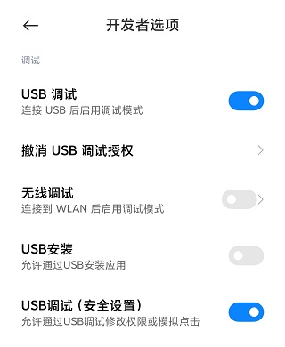  
    部分系统需要同时开启“USB 调试”下方的“USB 调试（安全设置）”，否则无法通过 ADB 设置分辨率。  
    ​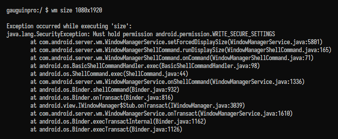
6. 执行 `adb devices` 命令，列出设备。  
    若连接成功，会显示类似这样的提示：

    ```text
    List of devices attached
    2ab5d50e    device
    ```
7. 执行 `adb shell` 命令，进入 Shell 环境。  
    ​
8. 执行 `wm size` 命令，查看和记下设备的**默认分辨率**，还原的时候会用到。  
    ​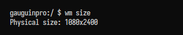
9. 执行 `wm size 宽x高` 命令，设置想要在远程桌面中使用的分辨率。

    > “宽”和“高”对应手机竖屏状态下的数值（请参考默认分辨率），例如 `wm size 1080x1920`。  
    > 不建议设置过大或过小的分辨率，以免导致系统出错。  
    > 执行命令前，请务必**检查确认无误**。  
    > 执行命令后，**手机的分辨率会变为指定的值**。  
    > 如果不小心设置错了，可以尝试执行 `wm size reset` 或 `wm size 默认分辨率` 命令进行还原。
    >

    
10. 打开客户端的分辨率设置，可以发现给出的分辨率值变了，但是比指定的小了一些（可能是减去了通知栏或导航栏的高度）。  
     ​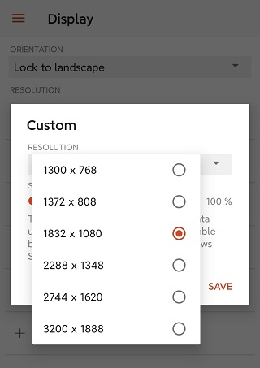
11. 加上相差的值，再执行一次命令。  
     ​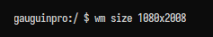
12. 再次打开客户端的分辨率设置，分辨率正确了。

     > 这时候就可以点击“SAVE”把当前的分辨率保存下来了。
     >

     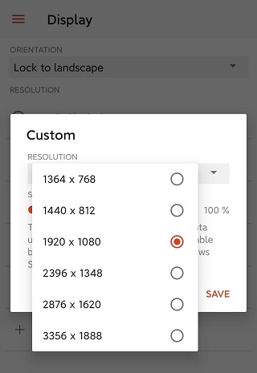
13. 以相同的方式，设置其他不同的分辨率。  
     ​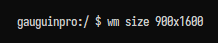  
     ​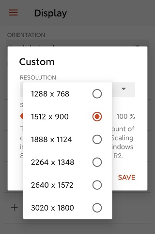  
     ​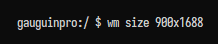  
     ​
14. 保存完所有需要的分辨率后，执行 `wm size reset` 或 `wm size 默认分辨率` 命令，把手机的分辨率还原为默认值。
15. 重新打开客户端，保存的分辨率都在，且有效果。  
     ​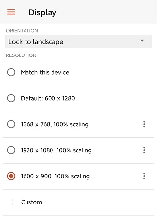
16. 执行 `exit` 命令，退出 Shell 环境。  
     ​
17. 执行 `adb kill-server` 命令，结束 ADB 服务。  
     ​
18. 现在可以关闭 USB 调试，然后断开手机与电脑的连接了。

‍
