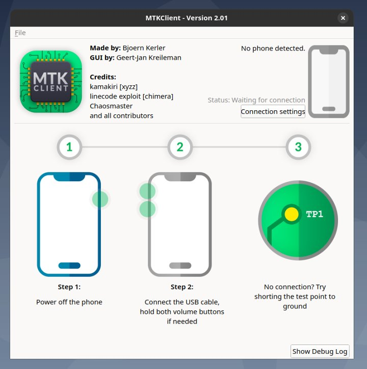
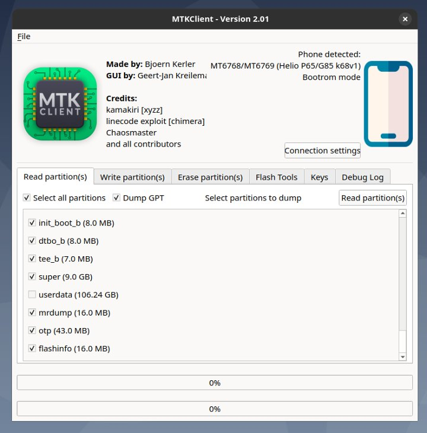
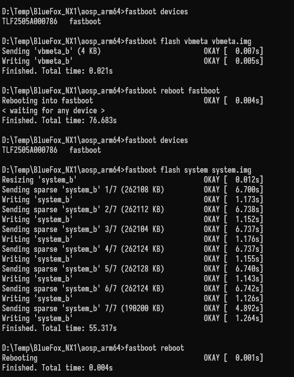

# 蓝狐（BLUEFOX）NX1 刷 GSI 系统

> 主要记录一下操作过程，操作前请确保具备一定的刷机经验。

## 所需工具和文件

1. MTK Client（可选，主要用于备份分区）。
2. ADB 工具（[下载地址](https://developer.android.google.cn/tools/releases/platform-tools?hl=zh-cn)）。
3. GSI 文件包（例如 [Google GSI](https://developer.android.google.cn/topic/generic-system-image/releases?hl=zh-cn)，本文中使用的是 `aosp_arm64-exp-BP1A.250405.005.C1-13151952-61d23231.zip`）。

## 操作步骤

### 一、使用 MTK Client 备份分区

手机关机，打开 MTK Client 软件，手机同时按住“音量加”和“音量减”键，然后通过数据线连接到电脑。

​

使用 MTK Client 的“Read partition”功能读出除“userdata”（用户数据）以外的分区，备份，以便刷坏了可以还原。

​

### 二、解锁 BootLoader

> 注意：解锁操作会清除手机数据，恢复出厂设置。

进入手机设置的“开发人员选项”，打开“USB 调试”和“OEM 解锁”选项的开关。

将手机通过数据线连接到电脑。

电脑在 ADB 工具的目录下执行 `adb devices` 命令，此时手机上应该会弹出授权提示窗口，点击“允许”以授权。

然后执行 `adb reboot bootloader` 命令，等待几秒钟，直到设备重新启动进入引导加载程序。

> 注意：进入 fastboot 模式后，大概率会因为没有驱动程序，执行 `fastboot` 命令失败，需要参考“[https://www.cnblogs.com/changweijinghu/p/16880803.html](https://www.cnblogs.com/changweijinghu/p/16880803.html)”解决。
>
> 驱动程序下载地址：[获取 Google USB 驱动程序](https://developer.android.com/studio/run/win-usb) / [usb_driver_r13-windows.zip](https://dl.google.com/android/repository/usb_driver_r13-windows.zip)

之后执行命令 `fastboot flashing unlock`，手机屏幕上会显示解锁确认：

```text
Press the Volume UP/Down buttons to select Yes or No.
Yes (Volume UP): Unlock (may void warranty).
No (Volume Down): Do not unlock bootloader.
```

此时按下“音量加”键，确认解锁（**将会清除手机数据，恢复出厂设置**）。

等待片刻，如无意外，会显示“解锁成功”。

### 三、刷入 GSI

将下载的 GSI 文件包解压到 ADB 工具所在文件夹内。

> 例如本文使用的 `aosp_arm64-exp-BP1A.250405.005.C1-13151952-61d23231.zip`，可以解压得到 `system.img` 和 `vbmeta.img` 这两个镜像文件。

依次执行以下命令，刷入镜像：

```text
fastboot flash vbmeta vbmeta.img
fastboot reboot fastboot
fastboot flash system system.img
fastboot reboot
```

> 注意：执行 `fastboot reboot fastboot` 命令后如果等待比较久都没出现“Finished”提示，则需要插拔一下数据线。

​

‍
