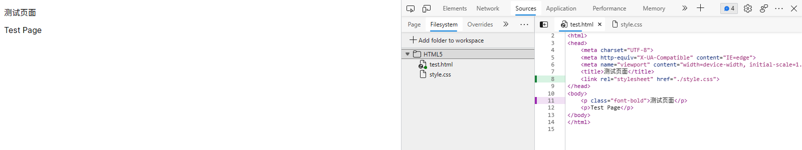

# 浏览器 DevTools（开发人员工具）部分实用功能介绍

> 浏览器的 DevTools（开发人员工具）是在前端开发中常用到的工具，其中的 Elements（元素）、Console（控制台）、Sources（源代码）以及 Network（网络）是最常用的四个模块。这里主要介绍最常见的修改网页文本功能以及一些比较实用的功能。

## 修改网页内容

这是最基础和最简单的用法，只需要点击左上角的“选择元素”按钮，然后在页面上点击需要修改的元素，即可在 DevTools 的 Elements（元素）页面对其进行修改。

  
​  
​

## 设备模拟

在开发响应式页面或为页面适配移动端时常用的一个功能，点击左上角的“Toggle device emulation”按钮即可启用。

可以在右侧的“More options”下拉菜单中打开默认隐藏的功能：

media queries（媒体查询）、rules（标尺）、device pixel ratio（DPR）、device type（设备类型）

在左侧的“Dimensions”下拉菜单中可以快速切换到一些预置的设备分辨率：

## Console（控制台）

DevTools 的 Console 是在开发过程中常用的功能之一，在其中可以进行计算（小数有浮点精度问题）、执行 JavaScript 代码等操作。

### \$0

在 DevTools 的 Elements 面板中选中 DOM 节点后，可以看到它的后方显示 `== $0`：

实际上，`$0` 是对当前选中的 DOM 节点的引用。

除此之外，`$1`​ 是对上一次选择的 DOM 节点的引用，一直到 `$4`。

### \$ 和 \$\$

在默认情况下（没有定义过 `$`​ 变量），它在 Console 中是 `document.querySelector` 的别名。

而 `$$`​ 则类似 `document.QuerySelectorAll`，但它返回的是包含 DOM 节点的数组，而不是 NodeList。

### \$\_

在 Console 中，可以通过 `$_` 快速引用最后一次的执行结果：

## Elements（元素）

### Toggle Element State（切换元素状态）

通过该功能，可以切换元素的不同状态（focus、hover 等），在为元素的不同状态设置样式时比较方便。

### Element Classes（元素类名）

可以快速地对元素进行添加类名、开启类名、关闭类名操作，预览效果。

### New Style Rule（添加样式规则）

可用于临时添加样式规则，点击后会自动添加对于选中的元素的选择器。

### Copy

右键点击一个元素，可在右键菜单的“Copy”项中复制对于该元素的 CSS 选择器（Copy selector）或 JavaScript 路径（Copy JS path）。

Copy selector：`#head_wrapper > div > div`​  
Copy JS path：`document.querySelector("#head_wrapper > div > div")`

## Sources（源代码）

### Filesystem（文件系统）

在“Filesystem”中添加本地文件夹：

之后就可以在 DevTools 中修改本地文件并保存（需要手动保存）。

不过，只支持实时预览样式文件的修改。

### Snippets（代码片段）

可以在这里添加常用的代码片段，用于复制或执行（在右键菜单中点击“Run”）。

DevTools 代码片段合集：[DevTools Snippets](http://bgrins.github.io/devtools-snippets/)

## 保持页面聚焦

点击 DevTools 标签栏中的加号（More Tools），选择其中的“Rendering”。

勾选页面中的“Emulate a focused page”。

之后网页会被模拟为聚焦状态，即使它不在前台。此时执行 `document.hasFocus()`​ 会返回 `true`。通过该功能，可以阻止大部分网站检测用户是否离开页面。

## 截屏

点击 DevTools 右上角的下拉菜单按钮，点击其中的“Run command”（也可以直接使用快捷键），打开命令面板。

然后输入“shot”或“screenshot”，之后可以看到以下几个选项：

依次分别为：

- 截取指定区域
- 截取完整页面
- 截取选中的 DOM 节点
- 截取当前页面

可以通过“箭头”键和“Enter”键或鼠标点击进行操作，截屏完成后会在“下载”中显示。

‍
