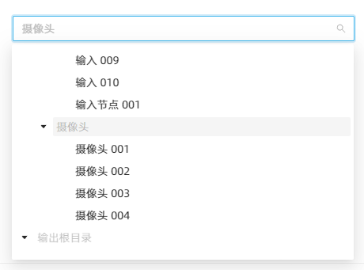

# 解决 Ant TreeSelect（树选择）组件可以使用键盘选中 disabled（已禁用）项的问题

最近在使用 Ant Design Vue（V3.2.20）的 TreeSelect 组件时发现一个问题：`tree-data` 中部分数据的 `disabled` 属性设置为了 `true`，选项是“禁用”状态，无法通过鼠标点击选中，但是可以通过键盘 `↑` `↓` 键切换选项，按下 `Enter` 键选中。

一开始还以为是 bug，后来通过查阅 [文档](https://3x.antdv.com/components/tree-select-cn#API) 和测试发现，该组件还有一个名为 `selectable` 的属性，用于控制选项是否可选。

仅将选项的 `selectable` 属性设置为 `false` 时，对应的选项虽然文本颜色不变，但是不可通过点击或键盘选中。

因此，如果要实现选项变为灰色且不可选的效果，需要同时将选项的 `disabled` 属性设置为 `true`，将 `seletable` 属性设置为 `false`。
