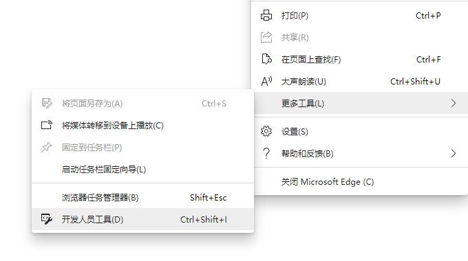
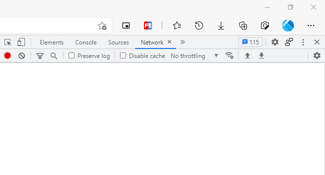

# 「JavaScript」将 Dynmap 网页上的地图图片合成为一张图

游戏版本：Minecraft Java Edition 1.12.2

已测试 Dynmap 版本：3.0

---

## 简介

根据我的 Minecraft 服务器的一位玩家的需求写的 JavaScript，可自动将 Dynmap 网页上分块的地图图片合成为一张图。建议使用 `Chrome`​ 浏览器或 `Chromium` 内核的浏览器进行操作。

因为是在 `前端` 进行合成，需要在操作前浏览一次要导出的地图区域。不建议合成过大的区域，否则可能会导致浏览器崩溃。

结果会在新窗口中显示（若不能弹出新窗口，请将 `弹出新窗口`​ 设置为 `允许`）。

本代码可能并不是最优的方案，欢迎各位在评论区提出建议。

若您是服务器的管理人员，可尝试使用下列插件：

- [Leaflet.print](https://github.com/aratcliffe/Leaflet.print)
- [Leaflet-image](https://github.com/mapbox/leaflet-image)
- [Leaflet-easyPrint](https://github.com/rowanwins/leaflet-easyPrint)
- [leaflet.browser.print](https://github.com/Igor-Vladyka/leaflet.browser.print)
- [Leaflet.BigImage](https://github.com/pasichnykvasyl/Leaflet.BigImage)

## 代码

> 更新：2020-12-23

```javascript
function dataURLtoBlob(dataURL) {
    var arr = dataURL.split(',');
    var mime = arr[0].match(/(:)(.*?)(;)/)[2]; // MIME
    var bStr = atob(arr[1]);                   // 解码
    var bLength = bStr.length;
    var u8Arr = new Uint8Array(bLength);

    while (bLength--) {
        u8Arr[bLength] = bStr.charCodeAt(bLength);
    }

    return new Blob([u8Arr], { type: mime });
}

function exportMap() {
    var base64Data = '';
    var images = document.querySelectorAll('#mcmap .map .leaflet-map-pane .leaflet-tile-pane .leaflet-layer img');
    var imagesCount = images.length;                                 // 图片数量
    var resultWindow = window.open('', '', 'width=800, height=480'); // 新窗口：显示结果

    // 提取 translate3d X Y Z 的值（文本）并转换为数字
    function getTransInfo(elem) {
        var reg = new RegExp(/(translate3d\(|px|\))/, 'g');
        var transInfo = elem.style.transform.replace(reg, '').split(', ').map(Number);

        // X, Y
        return [transInfo[0], transInfo[1]];
    }

    // 获取 Transform 最值信息
    function getTransMax() {
        console.log('获取 Transform 最值信息');

        var image_trans;
        var min_x = 0, min_y = 0, max_x = 0, max_y = 0;

        for (let i = 0; i < imagesCount; i++) {
            image_trans = getTransInfo(images[i]);
            if (image_trans[0] < min_x) {
                min_x = image_trans[0];
                // console.log("min_x 元素：" + i);
            }
            if (image_trans[1] < min_y) {
                min_y = image_trans[1];
                // console.log("min_y 元素：" + i);
            }
            if (image_trans[0] > max_x) {
                max_x = image_trans[0];
                // console.log("max_x 元素：" + i);
            }
            if (image_trans[1] > max_y) {
                max_y = image_trans[1];
                // console.log("max_y 元素：" + i);
            }
        }

        // max 加上图片大小
        max_x += images[0].width;
        max_y += images[0].height;

        return [min_x, min_y, max_x, max_y];
    }

    // 绘制
    function draw(fn) {
        // fn：绘制结束时的回调函数

        console.log("开始绘制");

        var trans_info = getTransMax();
        var canvasElem = document.createElement('canvas');
        var ctx = canvasElem.getContext('2d');

        canvasElem.width = trans_info[2] - trans_info[0];  // 画布元素宽度
        canvasElem.height = trans_info[3] - trans_info[1]; // 画布元素高度

        // 填充画布
        // ctx.rect(0, 0, canvasElem.width, canvasElem.height);
        // ctx.fillStyle = '#FFF';
        // ctx.fill();

        function drawing(n) {
            // n：绘制次数

            if (n < imagesCount) {
                // 自动计算坐标
                var image_trans = getTransInfo(images[n]);
                var pos_x = image_trans[0] + Math.abs(trans_info[0]);
                var pos_y = image_trans[1] + Math.abs(trans_info[1]);

                // console.log('绘制中：' + n + ' / ' + imagesCount);
                // console.log('坐标：' + pos_x + ', ' + pos_y);
                ctx.drawImage(images[n], pos_x, pos_y);

                // 递归
                arguments.callee(n + 1);
            } else {
                console.log('已合成，等待显示图片');

                // base64Data = canvasElem.toDataURL('image/jpeg', 0.8); // JPEG
                base64Data = canvasElem.toDataURL('image/png');          // PNG

                fn();
            }
        }

        drawing(0);
    }

    // 开始
    (function () {
        console.log('开始合成图片');

        draw(function () {
            // 回调函数：显示图片
            console.log('显示图片');
            var blobData = dataURLtoBlob(base64Data);
            var url = URL.createObjectURL(blobData);
            resultWindow.document.write('');
            resultWindow.focus();
            console.log('结束');
        });
    })();
}

exportMap();
```

## 使用方式（二选一）

#### 常规方式

1. 在浏览器打开 Dynmap 的页面。
2. 根据需要调整地图的缩放比例（不建议太大）。
3. 打开浏览器的 `开发人员工具`​（可使用快捷键 `Ctrl + Shift + I`）。  
    ​  
    **建议将** **​`开发人员工具`​**​ **设置为独立窗口显示模式，以让网页有更大的显示区域：**

    右上角的三个点 -\> Dock side -\> Unlock info separate window
4. 拖动地图，直至需要导出的地图范围都完成加载。
5. 切换到 `Console`​（控制台）标签页，并将上方的 `代码` 粘贴至输入区。  
    ​
6. 按下 `Enter`（回车），等待即可。

#### 对于管理员

- 若您是服务器的管理人员，且对 HTML、CSS、JavaScript 有了解，可将本代码写入到 Dynmap 的网页中（例如：作为点击事件绑定到特定的按钮上）。

‍
