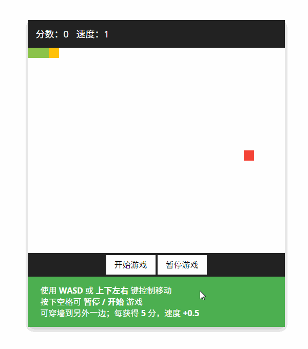
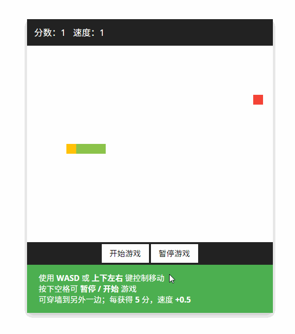
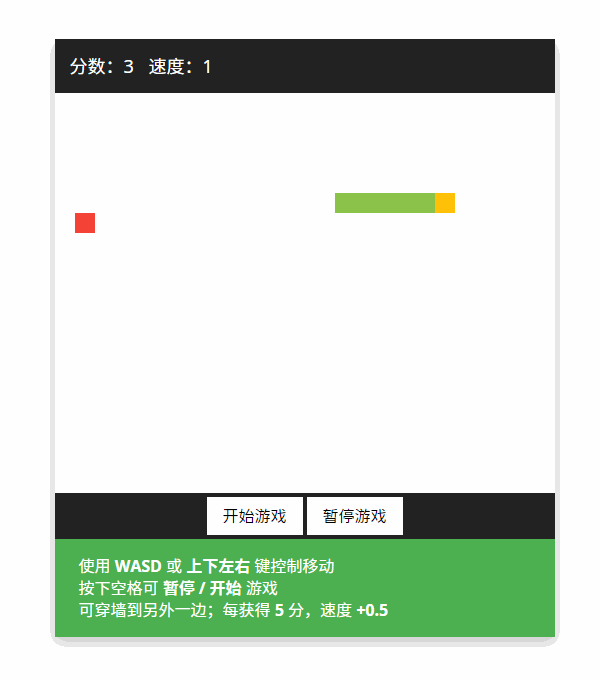
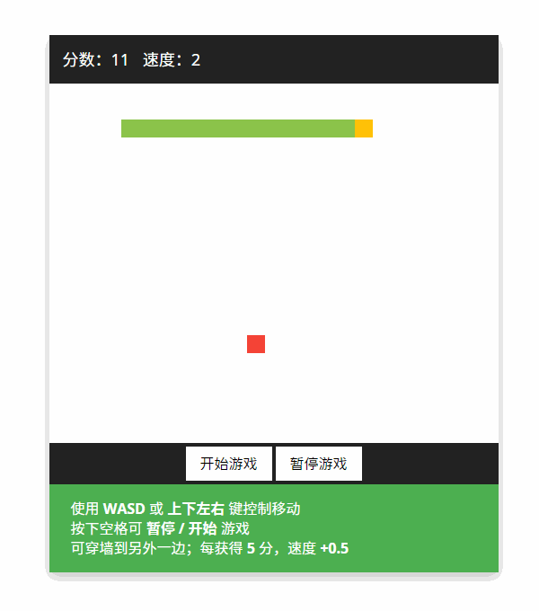

# 「Web 前端」原生 JavaScript 实现贪吃蛇游戏

使用 `WASD`​ 或 `上下左右` 键控制移动；

按下 `空格`​ 可 `暂停`​ 或 `开始` 游戏；

可穿墙到另外一边；每获得 `5`​ 分，速度 `+0.5`。

仅分享交流，代码不一定是最好的。

---

## 预览图

#### 打开


#### 暂停



#### 穿墙



#### 加速



#### 游戏结束



## 代码

#### index.html

```html
<!DOCTYPE html>
<html>
<head>
    <meta charset="UTF-8">
    <meta name="viewport" content="width=device-width, initial-scale=1.0">
    <title>贪吃蛇</title>
    <link rel="stylesheet" href="./style.css">
</head>
<body>
    <div id="snack-game" class="snack-game">
        <div class="info">
            分数：<span class="score">-1</span>
            速度：<span class="speed">-1</span>
        </div>
        <div class="map"></div>
        <div class="ctrl">
            <button class="btn-start">开始游戏</button>
            <button class="btn-pause">暂停游戏</button>
        </div>
        <div class="help">
            <p>使用 <strong>WASD</strong> 或 <strong>上下左右</strong> 键控制移动</p>
            <p>按下空格可 <strong>暂停 / 开始</strong> 游戏</p>
            <p>可穿墙到另外一边；每获得 <strong>5</strong> 分，速度 <strong>+0.5</strong></p>
        </div>
        <div class="alert-box"></div>
    </div>
    <script src="./script.js"></script>
</body>
</html>
```

#### style.css

```css
@charset "UTF-8";

body, .snack-game * {
    margin: 0;
    padding: 0;
}

.snack-game {
    position: fixed;
    top: 50px;
    left: 50%;
    box-shadow: 0 5px 15px rgb(0 0 0 / 0.25);
    background-color: #FFF;
    transform: translateX(-50%);
    user-select: none;
}

.snack-game .info {
    padding: 15px;
    background-color: #222;
    text-align: left;
    font-size: 18px;
    color: #FFF;
}

.snack-game .info span {
    display: inline-block;
}
.snack-game .info span:not(:last-child) {
    margin-right: 10px;
}

.snack-game .map {
    position: relative;
    width: 500px;
    height: 400px;
    background-color: #FFF;
}

.snack-game .map > div {
    position: absolute;
}

.snack-game .ctrl {
    padding: 4px;
    background-color: #222;
    text-align: center;
    font-size: 0;
}

.snack-game .ctrl button {
    margin: 0 2px;
    padding: 8px 16px;
    outline: none;
    border: none;
    border-radius: 0;
    background-color: #FFF;
    font-size: 16px;
    cursor: pointer;
    transition: all 0.25s;
}
.snack-game .ctrl button:hover {
    background-color: #444;
    color: #FFF;
}
.snack-game .ctrl button:disabled {
    opacity: 0.5;
}

.snack-game .help {
    padding: 1em 1.5em;
    background-color: #4CAF50;
    font-size: 16px;
    color: #FFF;
}

.snack-game .alert-box {
    display: block;
    position: absolute;
    top: 40%;
    left: 50%;
    padding: 1em 1.5em;
    box-shadow: 0 0.2em 0.8em rgb(0 0 0 / 0.25);
    background-color: #222;
    text-align: center;
    font-size: 18px;
    color: #FFF;
    opacity: 0;
    transform: translate(-50%, -50%);
    transition: opacity 0.25s;
    pointer-events: none;
    user-select: none;
}
```

#### script.js

```javascript
function SnackGame(options) {
    this.gameElem = options.gameElem;
    this.mapElem = this.gameElem.querySelector('.map');

    // 地图大小
    this.mapWidth = options.mapWidth || 400;
    this.mapHeight = options.mapHeight || 400;

    // 食物大小（蛇身大小以此为参考）
    this.foodSize = options.foodSize || 20;

    // 速度增加量
    this.speedUpRate = options.speedUpRate || 0.5;

    // 可穿墙到另一边
    this.canCross = options.canCross || false;

    // 转向标记
    this.directionChanged = false;

    // 无敌模式
    this.godMode = false;

    // Game Over 标记
    this.over = false;

    // 定时器
    this.timer = null;

    this.init();
}

// 提示框
SnackGame.prototype.alert = function (content, time) {
    // content：提示内容
    // time：时长（秒）

    var alertBox = this.gameElem.querySelector('.alert-box');

    time = time === undefined ? 5 : time;

    alertBox.innerHTML = content;
    alertBox.style.opacity = '1';

    setTimeout(function () {
        alertBox.style.opacity = '0';
    }, time * 1000);
};

// 初始化地图
SnackGame.prototype.initMap = function () {
    this.mapElem.style.height = this.mapHeight + 'px';
    this.mapElem.style.width = this.mapWidth + 'px';

    // 游戏已经结束，重置地图
    if (this.over) {
        this.removeSnack();
        this.removeFood();
        this.over = false;
    }

    // 蛇的信息
    this.snackInfo = { height: this.foodSize, width: this.foodSize };
    this.snackBody = [
        { x: 2, y: 0 },   // 蛇头    第一个点
        { x: 1, y: 0 },   // 蛇脖子  第二个点
        { x: 0, y: 0 }    // 蛇尾    第三个点
    ];
    this.snackDirection = 'right';

    // 食物信息
    this.foodInfo = { x: 0, y: 0 };

    // 分数、速度
    this.score = 0;
    this.speed = 1;

    this.updateScore();
    this.createSnack();
    this.createFood();
};

// 创建蛇
SnackGame.prototype.createSnack = function () {
    // 蛇的信息
    var width = this.snackInfo.width;
    var height = this.snackInfo.height;
    var color = '#8BC34A';
    var colorHead = '#FFC107';

    // 创建
    for (var i = 0; i < this.snackBody.length; i++) {
        // 吃到食物时，x == null，不创建（防止在 0, 0 处新建）
        if (this.snackBody[i].x != null) {

            // 创建元素
            var snackElem = document.createElement('div');

            snackElem.style.left = this.snackBody[i].x * width + 'px';
            snackElem.style.top = this.snackBody[i].y * height + 'px';

            snackElem.style.width = width + 'px';
            snackElem.style.height = height + 'px';
            snackElem.style.backgroundColor = i === 0 ? colorHead : color;

            // 保存节点，便于删除
            this.snackBody[i].elem = snackElem;

            // 插入
            this.mapElem.appendChild(snackElem);
        }
    }
};

// 删除蛇
SnackGame.prototype.removeSnack = function () {
    for (var i = 0; i < this.snackBody.length; i++) {
        // 当吃到食物时，elem == null，且不能删除
        if (this.snackBody[i].elem != null) {
            this.mapElem.removeChild(this.snackBody[i].elem);
        }
    }
};

// 创建食物
SnackGame.prototype.createFood = function () {
    // 食物要在网格中生成
    // 需要根据地图大小和食物大小计算网格

    // 食物信息
    var width = this.foodSize;
    var height = this.foodSize;
    var color = '#F44336';

    this.foodInfo.x = Math.floor(Math.random() * (this.mapWidth / width));
    this.foodInfo.y = Math.floor(Math.random() * (this.mapHeight / height));

    // 创建元素
    var foodElem = document.createElement('div');

    // X（生成在网格中）
    foodElem.style.left = this.foodInfo.x * width + 'px';
    // Y（生成在网格中）
    foodElem.style.top = this.foodInfo.y * height + 'px';

    foodElem.style.width = width + 'px';
    foodElem.style.height = height + 'px';
    foodElem.style.backgroundColor = color;

    // 保存节点，便于删除
    this.foodInfo.elem = foodElem;

    // 插入
    this.mapElem.appendChild(foodElem);
};

// 删除食物
SnackGame.prototype.removeFood = function () {
    this.mapElem.removeChild(this.foodInfo.elem);
};

// 蛇移动
SnackGame.prototype.snackMove = function () {
    // 移动

    // 后一个元素到前一个元素的位置
    // 蛇头独立处理，i 不能等于 0
    for (var i = this.snackBody.length - 1; i > 0; i--) {
        this.snackBody[i].x = this.snackBody[i - 1].x;
        this.snackBody[i].y = this.snackBody[i - 1].y;
    }

    // 根据方向处理蛇头
    switch (this.snackDirection) {
        case 'left':
            this.snackBody[0].x -= 1;
            break;
        case 'right':
            this.snackBody[0].x += 1;
            break;
        case 'up':
            this.snackBody[0].y -= 1;
            break;
        case 'down':
            this.snackBody[0].y += 1;
            break;
    }

    // 更新转向标记
    this.directionChanged = false;

    // 蛇头是否吃到食物（坐标重合）
    if (this.snackBody[0].x == this.foodInfo.x && this.snackBody[0].y == this.foodInfo.y) {
        // 加分
        this.score += 1;
        this.updateScore();

        // 蛇加一节
        // 蛇移动时会自动计算坐标，有坐标后，创建蛇时记录 elem
        this.snackBody.push({ x: null, y: null, elem: null });

        // 重新创建食物

        this.removeFood();
        this.createFood();
    }

    // 吃到自己
    // 从第 5 个开始判断（前 4 个永远撞不到）

    if (!this.godMode) {
        for (var i = 4; i < this.snackBody.length; i++) {
            if (this.snackBody[0].x == this.snackBody[i].x && this.snackBody[0].y == this.snackBody[i].y) {
                this.stopGame(true);
                return false;
            }
        }
    }

    // 蛇头是否出界

    // 网格
    var mapMaxX = this.mapWidth / this.snackInfo.width - 1;
    var mapMaxY = this.mapHeight / this.snackInfo.height - 1;

    // 判断
    var snackHead = this.snackBody[0];
    if (this.godMode || this.canCross) {
        // 无敌 / 穿墙
        snackHead.x = snackHead.x < 0 ? mapMaxX : (snackHead.x > mapMaxX ? 0 : snackHead.x);
        snackHead.y = snackHead.y < 0 ? mapMaxY : (snackHead.y > mapMaxY ? 0 : snackHead.y);
    } else if (snackHead.x < 0 || snackHead.x > mapMaxX || snackHead.y < 0 || snackHead.y > mapMaxY) {
        // 普通
        this.stopGame(true);
        return false;
    }

    // 重新创建蛇

    this.removeSnack()
    this.createSnack();
};

// 更新分数和速度
SnackGame.prototype.updateScore = function () {
    var scoreElem = this.gameElem.querySelector('.info .score');
    var speedElem = this.gameElem.querySelector('.info .speed');

    if (this.score != 0 && this.score % 5 === 0) {
        this.speed += this.speedUpRate;
        this.stopGame(false);
        this.startGame();
    }

    scoreElem.textContent = this.score;
    speedElem.textContent = this.speed;
};

// 游戏开始
SnackGame.prototype.startGame = function () {
    var self = this;

    // 游戏已结束，重置地图
    if (self.over) {
        self.alert('游戏重新开始', 1);
        self.initMap();
    }

    self.timer = setInterval(function () {
        self.snackMove();
    }, 400 / this.speed);
};

// 游戏结束
SnackGame.prototype.stopGame = function (isOver) {
    clearInterval(this.timer);
    this.timer = null;

    if (isOver) {
        this.over = true;
        this.alert(`[游戏结束]<br>您的分数为 ${this.score}`, 5);
    }
};

// 初始化事件
SnackGame.prototype.initEvents = function () {
    var self = this;

    // 按键
    document.body.onkeydown = function (e) {
        var ev = e || window.event;

        // 禁止二次转向
        if (self.directionChanged) {
            return true;
        }

        // 按下的键
        var kc = ev.keyCode;
        // 上 下 左 右 W A S D
        var kcs = [
            37, 38, 39, 40,
            65, 87, 68, 83
        ];
        // 方向
        var directions = [
            'left', 'up', 'right', 'down',
            'left', 'up', 'right', 'down'
        ];
        var directionsFlip = [
            'right', 'down', 'left', 'up',
            'right', 'down', 'left', 'up'
        ];

        var kcIndex = kcs.indexOf(kc);

        // 1. Key Code 符合条件且游戏已开始
        // 2. 蛇头当前方向不是目标方向的反方向
        // 3. 蛇头当前方向与目标方向不相同
        if (kcIndex != -1 && self.timer != null) {
            if (self.snackDirection != directionsFlip[kcIndex] && self.snackDirection != directions[kcIndex]) {
                self.snackDirection = directions[kcIndex];
                self.directionChanged = true;
            }
        }

        // 空格 暂停 / 开始 游戏
        if (kc === 32) {
            if (self.timer === null) {
                // 暂停时 - 开始游戏
                self.startGame();
            } else {
                // 运行时 - 停止游戏
                self.stopGame(false);
            }
            // 阻止默认按键事件
            return false;
        }
    };

    // 按钮：开始游戏
    var btnStart = self.gameElem.querySelector('.ctrl .btn-start');
    btnStart.onclick = function () {
        // 游戏已开始
        if (self.timer != null) {
            self.alert('游戏已经开始', 1);
            return false;
        }
        // 开始游戏
        self.startGame();
    };

    // 按钮：暂停游戏
    var btnPause = self.gameElem.querySelector('.ctrl .btn-pause');
    btnPause.onclick = function () {
        // 游戏已开始
        if (self.timer != null) {
            self.stopGame(false);
        } else {
            self.alert('游戏未在运行', 1);
        }
    };
};

// 游戏初始化
SnackGame.prototype.init = function () {
    if (this.mapWidth % this.foodSize != 0 || this.mapHeight % this.foodSize != 0) {
        this.alert('[初始化失败]<br>地图大小与食物大小<br>不成比例', 10);
        return false;
    }

    this.initMap();
    this.initEvents();

    this.alert('贪吃蛇<br>Snake', 2);
};

var game = new SnackGame({
    gameElem: document.querySelector('#snack-game'),
    mapWidth: 500,
    mapHeight: 400,
    foodSize: 20,
    speedUpRate: 0.5,
    canCross: true
});
```

‍
