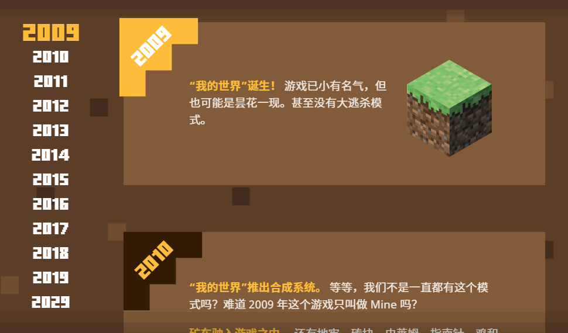

# Minecraft 十周年，感谢有你

不知不觉，距离 Minecraft 首个公开版本的发布日（2009 年 5 月 13 日）已经有 10 年了，Minecraft 十周年（2019年5月17日）即将到来，我接触 Minecraft 这款游戏也将近有 7 年了。十年以来，Minecraft 带给了我们很多的欢笑、回忆和感动。

​

还记得，初次接触 Minecraft 是在 2012 年的暑假。那天在网上寻找游戏，然后无意中看到了 Minecraft，那时候的版本是 1.2.5。我被其独特的画风（方块、像素）吸引了，就下载来玩了。

> 《Minecraft》是一款 3D 的第一人称沙盘游戏，所呈现的世界并不是华丽的画面与特效，而是注重在游戏性上面。玩家在游戏中做着「建设」与「破坏」两件事，但是透过像乐高一样的积木来组合与拼凑，轻而易举的就能制作出小木屋、城堡甚至城市，但是若再加上玩家的想像力，空中之城、地底都市都一样能够实现。 —— 百度百科

第一次运行 Minecraft 的时候，玩的是**生存模式**。在游戏时间的第一天，我用橡木木板盖了个**火柴盒**房子。到了晚上，我看到屋外有个手里捧着草方块的**末影人**（那时并不知道名字），我以为那是其他玩家，就走过去看了他几眼，然后…就没有然后了…

后来在优酷上看到了**籽岷**的 Minecraft 实况，很喜欢籽岷的那句话——“以纪录片的方式探索游戏世界”。再后来，还有凯麒、翔麟、鬼鬼蝈蝈、炎黄、粉字菌、大橙子、五歌、粉鱼、红叔……

还记得第一次被熊孩子袭击：事情发生在我刚开始进入服务器玩没多久。我和在服务器认识的朋友们在“热带雨林”建了个树屋，过了几天，突然有几个玩家来到我们的树屋旁边，说发现了个好地方，问我们要不要一起去，然后我们接受了。跟着他们走了一会，我突然感觉不对劲，就用命令（/home）回家了。果然，有玩家在放火烧我们的树屋（那时候资金不足，不能完整地圈地）。还好发现得早，火被灭了，并没有造成太大的损失。

2013 年 12 月，在贴吧偶然看到“鬼鬼 Minecraft 代购”。自此，我拥有了 Minecraft 正版账号。（那时候正版的价格是 190 ￥）

2015 年 7 月 10 日，我在 bilibili 上发布了第一个搬运的 Minecraft 视频。

2016 年 7 月 11 日，我在 bilibili 上发布了第一个原创的 Minecraft 教程向视频。

在 2016 年的某天，听说网易要代理 Minecraft。我听到此消息后，心情是激动的，充满期待（很多东西都会变得方便）。然而，到了 2017 年 Minecraft 中国版正式公开时（以及之后），并没有如我所愿……

2017 年 11 月 6 日，我在 bilibili 上发布了第一个原创的 Minecraft 展示向视频。

这只是其中一部分，还有其他难忘的事，这里就不一一列举了。

---

**还记得你在 Minecraft 的“第一次”吗？**

- 第一次挖到钻石
- 第一次建造房屋
- 第一次被苦力怕（Creeper）炸家
- 第一次死亡
- 第一次击败末影龙
- 第一次安装模组
- 第一次进入服务器
- 第一次被熊孩子袭击
- 第一次开服务器
- 第一次录制视频
- ……

**还记得那些 Minecraft 的老梗吗？**

- Minecraft 居然有圆了
- 砍手岩
- 我有 20 个铁块你怕不怕
- Minecraft 没有 BUG，这只是特性
- 移除了 HIM
- 挖三填一
- ……

**还记得那些在 Minecraft 中的神奇翻译吗？**

- 雷石东直放站
- 大火杆
- 银鱼
- ……

---

初次遇见 Minecraft，我还是一名初中生。到了现在，我已经是一名大学生了。在这七年里，我经历了：单机 → 服务器联机 → 自己开服务器。在 Minecraft 的十年里，它不断地更新，出现了多个版本：Java 版、便携版、基岩版、教育版、故事模式……但不要忘记，Minecraft 最初只是一个单人沙盒游戏。

可能有人会说 Minecraft 现在凉了，实际上并不是。任何一款游戏都会有生命期，总会有盛、衰的时候。这也许是最近 Minecraft 热度降低的原因。但是，Minecraft 拥有的扩展性，是很多游戏比不上的（资源包、模组、插件）。Minecraft 不只是游戏，你可以在其中做很多想做的事情，只有你想不到，没有它做不到。因此，Minecraft 肯定会有重新火起来的一天。

---

 **《那些年，我们一起玩过的 MC》**

https://v.youku.com/v\_show/id\_XNTMwNzY1MzMy.html

> 我喜欢被游戏感动，也喜欢用游戏感动别人。
>
> 有人十分郑重地问我，是否会有放弃 MC 的一天？
>
> 我无法想象那样的生活，MC 已经是我生活的一部分，无法隔离更加无法抛弃。
>
> 每一天可以很忙很累，然而却不能缺少这款游戏。
>
> 记得那时候，仅仅是因为惊叹于 MC 的创造性，也不失可爱。
>
> 后来却是逐渐地自己去感受这个不一样的世界的内涵。
>
> 当我站立在这个世界的时候，就像是拥有了第二生命。
>
> 我的人，随着灵魂到达遥远彼岸的一个方块世界。
>
> 从最底层通过努力一步步走向世界的顶端，甚至匪夷所思的杀死最强大的黑龙。
>
> 看着自己的足迹清晰地识别出自己曾经的存在。
>
> 不仅仅是如此，即使被一群僵尸围殴致死，即使被苦力怕炸得尸骨无存，甚至掉下岩浆，背包里面的东西都付之一炬，也没关系。
>
> 在这里死亡都不能阻挡我，因为下一秒我还可以站起来，还可以再次投入到这个世界。
>
> 为了自己曾经的正确去欢心，为了自己曾经的错误去忏悔。
>
> 就是这样一个不科学，很魔法的世界，带给我温馨和自我。MC 的世界，也忘不了曾经为了自己的生存而努力，不断随机应变。
>
> 因为你是为了活下去，而工作。
>
> 有时，你厌倦了。
>
> 出去走走，发现了一座哪怕只有一丁点儿大的村庄，都会值得庆祝。
>
> 像是成为一个求生的野蛮人，再次回到了人类的文明里面。
>
> 你可以整夜无眠地画一份农田规划图纸，即使电脑关闭，你无语地躺在床上，那些画面已经光亮如丝，照亮着孤独的夜晚。
>
> 你可以久违的失眠，偶尔傻傻地笑了。
>
> 找几个朋友，大家一起走进这个世界。
>
> 可以忘记现实里的烦恼，做一些荒诞的事情，尽情地憨笑，互相叫骂互相追逐。
>
> 大家在一起有个收获，便可以无限制地畅想一下，更为遥远的美好未来。
>
> 不管我们曾经做了什么，都会在 MC 留下自己的汗水和印记，留下感情和回忆。
>
> 它不是存档，而是鲜活的曾经。
>
> 无法放弃 MC，多年以后想起这个游戏，泛照着过去的记忆，感觉到无尽的愉悦。
>
> 也许会伴随着一丝心酸，那一个个鲜明的方块，一个个灵活的生物，一个个远去的邮轮，都会回到脑海，都是属于我的财富，让我永远也不想放弃。
>
> 50 年后我还会记得，那些年我们一起玩过的 MC。

---

**Minecraft，不只是游戏。**

**此生无悔入MC，来世愿做方块人。**

**下一个十年，你还会在这里吗？**

‍
