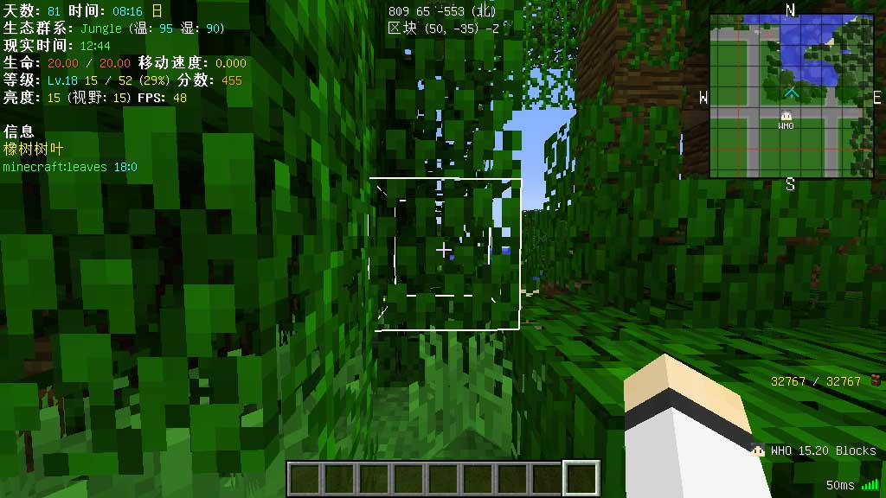
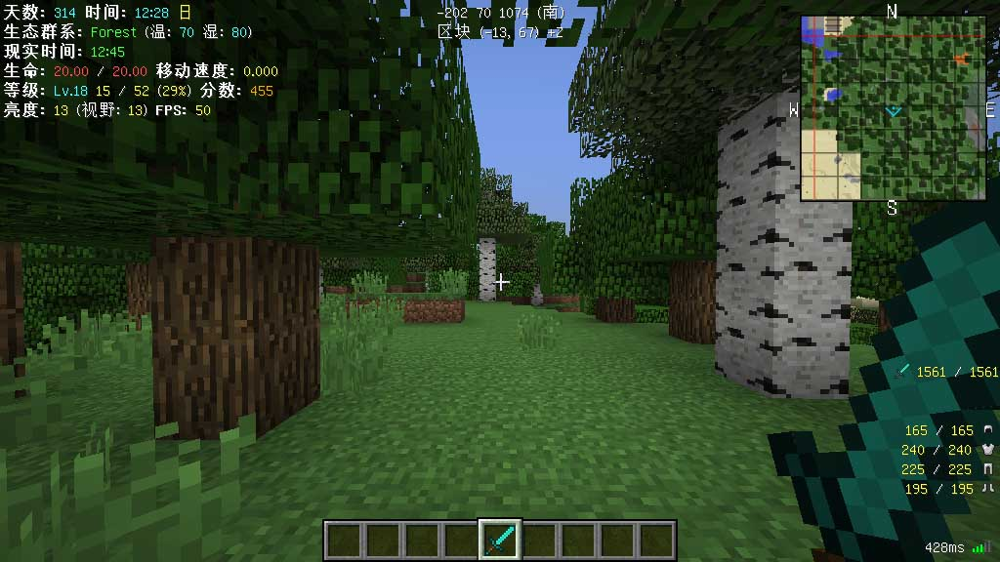
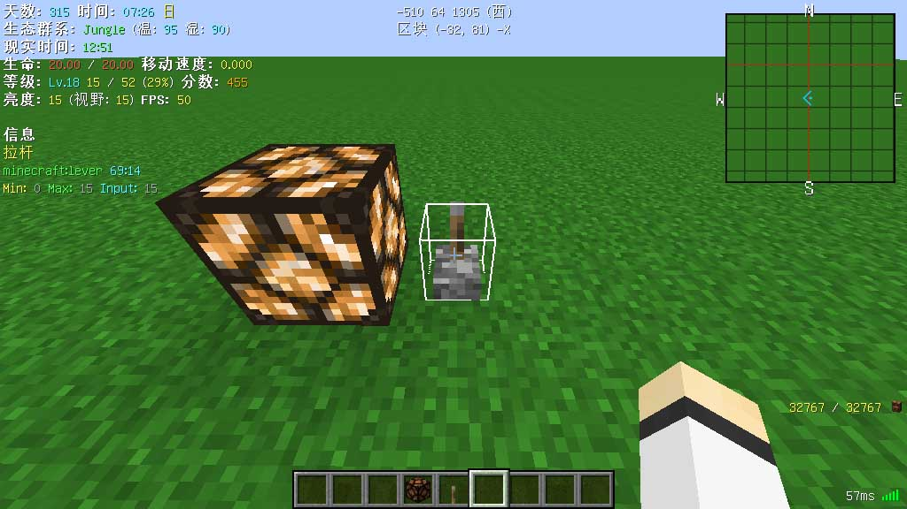
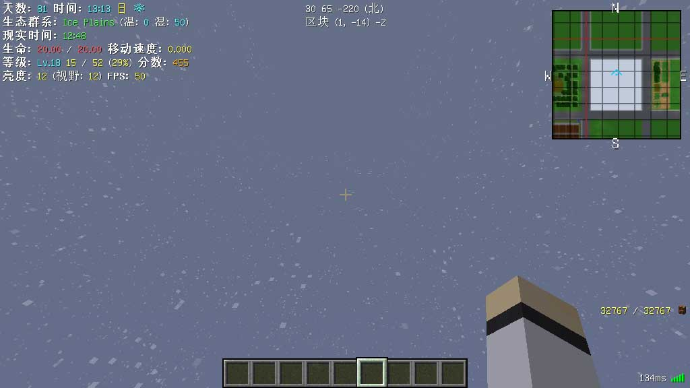
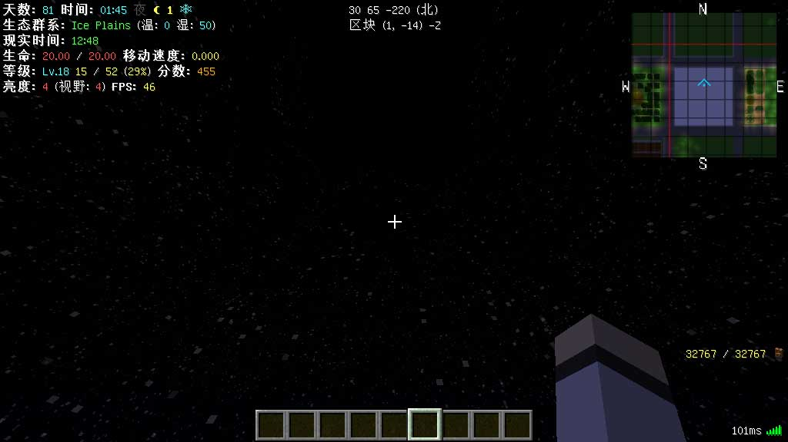
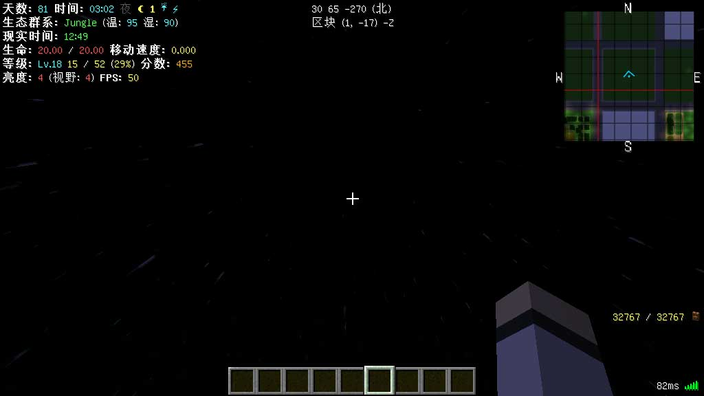

# 「Minecraft」In-Game Info XML 样式

模组本体：[In-Game Info XML](https://www.curseforge.com/minecraft/mc-mods/ingame-info-xml)

前置模组：[Lunatrius Core](https://www.curseforge.com/minecraft/mc-mods/lunatriuscore)

游戏版本：Minecraft Java Edition 正式版 1.12.2

---

## 说明

分享一下自己在用的 In-Game Info XML Mod 的样式。

## 使用方法

#### 方法一

1. 把代码保存为 `InGameInfo.xml`​ 文件（编码 `UTF-8`​），放入 `.minecraft/config/` 文件夹。
2. 启动游戏或直接在游戏中执行命令 `/igi reload` 进行加载。

#### 方法二

1. 把代码保存为 `文件名.xml`​ 文件（文件名自定义；编码 `UTF-8`​），放入 `.minecraft/config/` 文件夹。
2. 在游戏中执行命令 `/igi load 文件名.xml`​（`文件名` 是第 1 步中自己修改的文件名）进行加载。

## 效果图

  
​  
​  
​  
​  
​

## 代码

> 若需要二次修改发布，请保留原作者信息，谢谢！

### 完整版本

```xml
<?xml version="1.0" encoding="UTF-8" standalone="no"?>
<!-- 样式作者：Frost-ZX bilibili UID 936757 -->
<config>
    <!-- 位置 - 左上角 -->
    <lines at="topleft">
        <line>
            <str>天数: $b{day}$r 时间: $b{mctime24} $a({rltime24})$r </str>
            <if>
                <var>daytime</var>
                <str>$e日$r </str>
                <str>$8夜$r $e☾ {moonphase}$r </str>
            </if>
            <if>
                <var>raining</var>
                <str>$b☔$r </str>
            </if>
            <if>
                <var>thundering</var>
                <str>$b⚡$r </str>
            </if>
            <if>
                <var>snowing</var>
                <str>$b❄$r </str>
            </if>
            <op>
                <str>NE</str>
                <var>nextweatherchange</var>
                <num>?</num>
                <str>天气切换: $a{nextweatherchange}</str>
                <str></str>
            </op>
        </line>
        <line>
            <str>群系: $a{biome} $r(温: $b{temperature} $r湿: $b{humidity}$r)</str>
            <if>
                <var>slimechunk</var>
                <str> $a史莱姆区块 </str>
            </if>
            <if>
                <var>slimes</var>
                <str>(可生成)$f</str>
            </if>
        </line>
        <line>
            <str>亮度: </str>
            <max>
                <var>light</var>
                <num>7.5</num>
                <str>$e</str>
                <str>$c</str>
            </max>
            <var>light</var>
            <str>$r (视野: </str>
            <max>
                <var>lighteye</var>
                <num>7.5</num>
                <str>$e</str>
                <str>$c</str>
            </max>
            <var>lighteye</var>
            <str>$r) </str>
            <str>FPS: </str>
            <op>
                <str>GT</str>
                <var>fps</var>
                <num>60</num>
                <num>45</num>
                <num>30</num>
                <num>15</num>
                <num>0</num>
                <str>$a</str>
                <str>$e</str>
                <str>$6</str>
                <str>$c</str>
                <str>$4</str>
                <str></str>
            </op>
            <var>fps</var>
        </line>
        <line>
            <str>生命: $c{health} $r/ $c{maxhealth}$r 移动速度: $e{speed}</str>
        </line>
        <line>
            <str>等级: $bLv.{playerlevel} $e{xpthislevel}$f / $e{xpcap}$f ($e</str>
            <round>
                <pct>
                    <var>xpthislevel</var>
                    <var>xpcap</var>
                </pct>
                <num>0</num>
            </round>
            <str>%$f)$r </str>
            <str>分数: $6{score}</str>
        </line>
        <line>
            <str> </str>
        </line>
        <line>
            <max>
                <var>mouseoverid</var>
                <num>0.5</num>
                <str>信息</str>
                <str></str>
            </max>
        </line>
        <line>
            <max>
                <var>mouseoverid</var>
                <num>0.5</num>
                <str>$e{mouseovername}</str>
                <str></str>
            </max>
        </line>
        <line>
            <max>
                <var>mouseoverid</var>
                <num>0.5</num>
                <str>$a{mouseoveruniquename} $b{mouseoverid}:{mouseovermetadata}</str>
                <str></str>
            </max>
        </line>
        <line>
            <max>
                <var>mouseoverpowerinput</var>
                <num>0.5</num>
                <str>$eMin: $7{mouseoverpowerweak} $aMax: $7{mouseoverpowerstrong} $bInput: $7{mouseoverpowerinput}</str>
                <str></str>
            </max>
        </line>
    </lines>
    <!-- 位置 - 中上 -->
    <lines at="topcenter">
        <!-- 坐标 -->
        <line>
            <str>{xi} {yi} {zi} (</str>
            <op>
                <str>EQ</str>
                <var>abrfinedirection</var>
                <num>N</num>
                <num>NE</num>
                <num>E</num>
                <num>SE</num>
                <num>S</num>
                <num>SW</num>
                <num>W</num>
                <num>NW</num>
                <str>北</str>
                <str>东北</str>
                <str>东</str>
                <str>东南</str>
                <str>南</str>
                <str>西南</str>
                <str>西</str>
                <str>西北</str>
                <str>未知</str>
            </op>
            <str>)</str>
        </line>
        <!-- 区块 -->
        <line>
            <min>
                <var>speed</var>
                <num>1</num>
                <str>区块 ({chunkx}, {chunkz}) {axisdirection}</str>
                <str></str>
            </min>
        </line>
    </lines>
    <!-- 位置 - 右下角 -->
    <lines at="bottomright">
        <!-- 物品耐久度 -->
        <line>
            <var>mainhandicon</var>
            <str> </str>
            <op>
                <str>GE</str>
                <pct>
                    <var>mainhanddamageleft</var>
                    <var>mainhandmaxdamage</var>
                </pct>
                <num>50</num>
                <num>20</num>
                <num>10</num>
                <num>0</num>
                <str>$e</str>
                <str>$6</str>
                <str>$c</str>
                <str>$4</str>
                <str></str>
            </op>
            <max>
                <var>mainhanddamageleft</var>
                <num>0.5</num>
                <str>{mainhanddamageleft}$f / $e{mainhandmaxdamage}</str>
                <var>mainhandname</var>
            </max>
        </line>
        <line>
            <str> </str>
        </line>
        <!-- 状态效果 -->
        <line>
            <max>
                <var>potiondurationticks0</var>
                <num>0.5</num>
                <str>{potionduration0} {potionicon0}</str>
                <str></str>
            </max>
        </line>
        <line>
            <max>
                <var>potiondurationticks1</var>
                <num>0.5</num>
                <str>{potionduration1} {potionicon1}</str>
                <str></str>
            </max>
        </line>
        <line>
            <max>
                <var>potiondurationticks2</var>
                <num>0.5</num>
                <str>{potionduration2} {potionicon2}</str>
                <str></str>
            </max>
        </line>
        <line>
            <max>
                <var>potiondurationticks3</var>
                <num>0.5</num>
                <str>{potionduration3} {potionicon3}</str>
                <str></str>
            </max>
        </line>
        <line>
            <max>
                <var>potiondurationticks4</var>
                <num>0.5</num>
                <str>{potionduration4} {potionicon4}</str>
                <str></str>
            </max>
        </line>
        <line>
            <max>
                <var>potiondurationticks5</var>
                <num>0.5</num>
                <str>{potionduration5} {potionicon5}</str>
                <str></str>
            </max>
        </line>
        <line>
            <max>
                <var>potiondurationticks6</var>
                <num>0.5</num>
                <str>{potionduration6} {potionicon6}</str>
                <str></str>
            </max>
        </line>
        <line>
            <max>
                <var>potiondurationticks7</var>
                <num>0.5</num>
                <str>{potionduration7} {potionicon7}</str>
                <str></str>
            </max>
        </line>
        <line>
            <max>
                <var>potiondurationticks8</var>
                <num>0.5</num>
                <str>{potionduration8} {potionicon8}</str>
                <str></str>
            </max>
        </line>
        <line>
            <str> </str>
        </line>
        <!-- 装备耐久度 -->
        <line>
            <op>
                <str>GE</str>
                <pct>
                    <var>helmetdamageleft</var>
                    <var>helmetmaxdamage</var>
                </pct>
                <num>50</num>
                <num>20</num>
                <num>10</num>
                <str>$e</str>
                <str>$6</str>
                <str>$c</str>
                <str>$4</str>
            </op>
            <max>
                <var>helmetdamageleft</var>
                <num>0.5</num>
                <str>{helmetdamageleft}$f / $e{helmetmaxdamage}</str>
                <str></str>
            </max>
            <str> {helmeticon}</str>
        </line>
        <line>
            <op>
                <str>GE</str>
                <pct>
                    <var>chestplatedamageleft</var>
                    <var>chestplatemaxdamage</var>
                </pct>
                <num>50</num>
                <num>20</num>
                <num>10</num>
                <str>$e</str>
                <str>$6</str>
                <str>$c</str>
                <str>$4</str>
            </op>
            <max>
                <var>chestplatedamageleft</var>
                <num>0.5</num>
                <str>{chestplatedamageleft}$f / $e{chestplatemaxdamage}</str>
                <str></str>
            </max>
            <str> {chestplateicon}</str>
        </line>
        <line>
            <op>
                <str>GE</str>
                <pct>
                    <var>leggingsdamageleft</var>
                    <var>leggingsmaxdamage</var>
                </pct>
                <num>50</num>
                <num>20</num>
                <num>10</num>
                <str>$e</str>
                <str>$6</str>
                <str>$c</str>
                <str>$4</str>
            </op>
            <max>
                <var>leggingsdamageleft</var>
                <num>0.5</num>
                <str>{leggingsdamageleft}$f / $e{leggingsmaxdamage}</str>
                <str></str>
            </max>
            <str> {leggingsicon}</str>
        </line>
        <line>
            <op>
                <str>GE</str>
                <pct>
                    <var>bootsdamageleft</var>
                    <var>bootsmaxdamage</var>
                </pct>
                <num>50</num>
                <num>20</num>
                <num>10</num>
                <str>$e</str>
                <str>$6</str>
                <str>$c</str>
                <str>$4</str>
            </op>
            <max>
                <var>bootsdamageleft</var>
                <num>0.5</num>
                <str>{bootsdamageleft}$f / $e{bootsmaxdamage}</str>
                <str></str>
            </max>
            <str> {bootsicon}</str>
        </line>
        <line>
            <str> </str>
        </line>
        <!-- 附近的玩家 -->
        <line>
            <max>
                <var>nearbyplayerdistance0</var>
                <num>0</num>
                <str>{nearbyplayericon0} {nearbyplayername0} {nearbyplayerdistance0} Blocks </str>
                <str></str>
            </max>
        </line>
        <line>
            <max>
                <var>nearbyplayerdistance1</var>
                <num>0</num>
                <str>{nearbyplayericon1} {nearbyplayername1} {nearbyplayerdistance1} Blocks </str>
                <str></str>
            </max>
        </line>
        <line>
            <max>
                <var>nearbyplayerdistance2</var>
                <num>0</num>
                <str>{nearbyplayericon2} {nearbyplayername2} {nearbyplayerdistance2} Blocks </str>
                <str></str>
            </max>
        </line>
        <line>
            <max>
                <var>nearbyplayerdistance3</var>
                <num>0</num>
                <str>{nearbyplayericon3} {nearbyplayername3} {nearbyplayerdistance3} Blocks </str>
                <str></str>
            </max>
        </line>
        <line>
            <str> </str>
        </line>
        <!-- 延迟 -->
        <line>
            <max>
                <var>ping</var>
                <num>0.5</num>
                <str>{ping}ms {pingicon}</str>
                <str>检测中...</str>
            </max>
        </line>
    </lines>
</config>
```

### 简洁版本

```xml
<?xml version="1.0" encoding="UTF-8" standalone="no"?>
<!-- 样式作者：Frost-ZX bilibili UID 936757 -->
<config>
    <!-- 位置 - 左上角 -->
    <lines at="topleft">
        <line>
            <max>
                <var>mouseoverid</var>
                <num>0.5</num>
                <str>$e{mouseovername}</str>
                <str></str>
            </max>
        </line>
        <line>
            <max>
                <var>mouseoverid</var>
                <num>0.5</num>
                <str>$a{mouseoveruniquename} $b{mouseoverid}:{mouseovermetadata}</str>
                <str></str>
            </max>
        </line>
        <line>
            <max>
                <var>mouseoverpowerinput</var>
                <num>0.5</num>
                <str>$eMin: $7{mouseoverpowerweak} $aMax: $7{mouseoverpowerstrong} $bInput: $7{mouseoverpowerinput}</str>
                <str></str>
            </max>
        </line>
    </lines>
    <!-- 位置 - 中上 -->
    <lines at="topcenter">
        <!-- 坐标 -->
        <line>
            <str>{xi} {yi} {zi} (</str>
            <op>
                <str>EQ</str>
                <var>abrfinedirection</var>
                <num>N</num>
                <num>NE</num>
                <num>E</num>
                <num>SE</num>
                <num>S</num>
                <num>SW</num>
                <num>W</num>
                <num>NW</num>
                <str>北</str>
                <str>东北</str>
                <str>东</str>
                <str>东南</str>
                <str>南</str>
                <str>西南</str>
                <str>西</str>
                <str>西北</str>
                <str>未知</str>
            </op>
            <str>)</str>
        </line>
        <!-- 区块 -->
        <line>
            <min>
                <var>speed</var>
                <num>1</num>
                <str>区块 ({chunkx}, {chunkz}) {axisdirection}</str>
                <str></str>
            </min>
        </line>
    </lines>
    <!-- 位置 - 右下角 -->
    <lines at="bottomright">
        <!-- 延迟 -->
        <line>
            <max>
                <var>ping</var>
                <num>0.5</num>
                <str>{ping}ms {pingicon}</str>
                <str>检测中...</str>
            </max>
        </line>
    </lines>
</config>
```

‍
