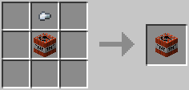
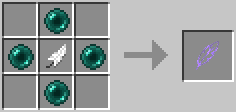
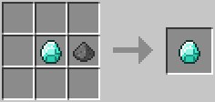
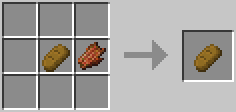
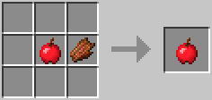
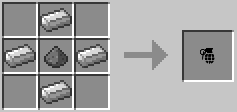
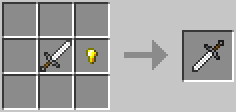

# 「Minecraft」Funny Items Mod

模组版本：Minecraft Java Edition 正式版 1.12.2 Forge 2768+

模组版本：1.0

模组作者：Frost-ZX

模组状态：停止更新

---

## 方块

#### TNT

> 类似“地雷”，有生物踩在上面就爆炸。

**合成表**（有序合成）

TNT（原版） + 铁粒  
​

**可配置项**

- 爆炸威力

---

## 物品

#### 羽毛

> 右键使用，自动将玩家传送到当前位置的空中（默认为当前高度 `+100`）。

**合成表**（有序合成）

羽毛(原版) + 末影珍珠 `4`​  
​

**可配置项**

- 传送高度差

#### 钻石

> 会爆炸的钻石，配合 `钻石（控制）` 使用。

**合成表**（无序合成）

钻石(原版) + 火药  
​

#### 钻石（控制）

> 右键使用，可以引爆玩家身上的 `钻石`（本 Mod 中的物品）。

---

## 食物

#### 面包

> 食用后，饥饿值 -5。

**合成表**（无序合成）

面包(原版) + 腐肉  
​

#### 苹果

> 食用后，饥饿值 -4。

**合成表**（无序合成）

苹果(原版) + 腐肉  
​

---

## 武器

#### 手榴弹

> 右键并松开丢出，击中目标就爆炸（受技术限制，暂不支持定时爆炸）。

**合成表**（有序合成）

火药 + 铁锭 `4`​  
​

**可配置项**

- 爆炸威力

#### 铁剑（异常）

> 攻击 `生物`​ 后，随机给予 `生物`​ 随机的 `伤害值`​ 或 `生命值`。

**耐久度**

251

**合成表**（无序合成）

铁剑 + 金粒  
​

**可配置项**

- 随机值的最大值

#### 钻石剑（异常）

> 攻击 `生物`​ 后，随机给予 `生物`​ 随机的 `伤害值`​ 或 `生命值`。

**耐久度**

1562

**合成表**（无序合成）

钻石剑 + 金粒  
​

**可配置项**

- 随机值的最大值

---

## 生物

#### 炸弹人

> 类似爬行者（Creeper），但行走速度是爬行者的 2 倍。

**图片**

**可生成的生物群系**

- Beaches
- Desert
- Savanna

**生命值**

20

**经验值**

10

**掉落物**

- 火药

**可配置项**

- 爆炸威力

---

## 命令

#### 说明

- ​`< >` 为必填内容。
- ​`[ ]` 为可选内容。

#### 主命令

- ​`/funnyitems` 显示可用的命令列表。
- ​`/funnyitems info` 获取模组信息。

#### 修改配置

- ​`/funnyitems get`  
  获取当前配置。
- ​`/funnyitems reset`​  
  重置配置（第一次使用或更新后如果发现有配置值为 0，最好执行一次，或手动将其 `set` 为默认值以免出现问题）。
- ​`/funnyitems set AttackRandomDiamond_Max <数值>`​  
  修改 `钻石剑（异常）` 的随机值的最大值（默认值 14）。
- ​`/funnyitems set AttackRandomIron_Max <数值>`​  
  修改 `铁剑（异常）` 的随机值的最大值（默认值 12）。
- ​`/funnyitems set DiamondExplode_Power <数值>`​  
  修改 `钻石` 的爆炸威力（默认值 4）。
- ​`/funnyitems set HandGrenade_Power <数值>`​  
  修改 `手榴弹` 的爆炸威力（默认值 4）。
- ​`/funnyitems set SteveExplode_Power <数值>`​  
  修改 `炸弹人` 的爆炸威力（默认值 2）。
- ​`/funnyitems set TNTA_Power <数值>`​  
  修改 `TNT` 的爆炸威力（默认值 4）。
- ​`/funnyitems set ToSky_High <数值>`​  
  修改 `羽毛` 的传送高度差（默认值 100）。

‍
