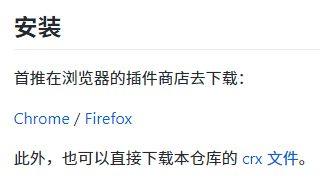
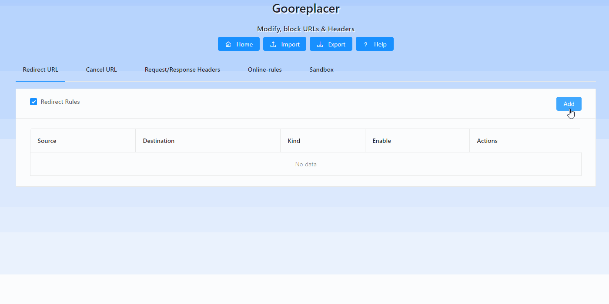

# 使用 gooreplacer 插件解决国内在 Minecraft 官网不能登录的问题

> 注意：
>
> 在 2019 年 9 月以及之后，在中国大陆已经可以正常登录。
>
> 本教程也适用于其它使用 reCAPTCHA 的网站。

浏览器：Google Chrome

扩展程序名称：gooreplacer

扩展程序介绍：[GitHub 仓库](#20250316184740-67klq0m)

注意事项：

其他 Chromium 内核的浏览器以及 Firefox 浏览器也可以使用本方法。

移动端的 Chrome 暂不支持安装扩展程序，如需使用请安装 Firefox 或其他支持安装扩展的浏览器。

---

## 前言

Minecraft 国际版官网启用了 reCAPTCHA 验证码，由于其使用了 google.com 的域名，在中国大陆不能正常加载，导致点击“登录”按钮后没有任何的反应。

本方法通过扩展程序把 `www.google.com/recaptcha` 重定向为 `recaptcha.net/recaptcha`，使 Minecraft 国际版官网上的 reCAPTCHA 能正常加载以登录。

## 安装扩展程序

#### 链接

- [Chrome 扩展](#20250316184736-kq0njqg)
- [Edge 扩展](#20250316184738-2d3t05i)
- [Firefox 扩展](#20250316184739-z21o91c)

#### 注意

由于 Chrome 网上应用商店使用了 google.com 的域名，所以一般情况下，在中国大陆也是不能访问的，你可能要通过以下的方法安装 gooreplacer 扩展程序（如果你使用的是 Firefox 浏览器，则可以直接安装）。

1. 进入 gooreplacer 扩展程序的 [GitHub 仓库](#20250316184740-67klq0m) 页面。
2. 在 `安装` 部分找到 `此外，也可以直接下载本仓库的 crx 文件` ，点击 [crx 文件](https://github.com/jiacai2050/gooreplacer/blob/master/gooreplacer.crx) 字段，然后在打开的页面中点击 [Download](https://github.com/jiacai2050/gooreplacer/raw/master/gooreplacer.crx) 即可下载扩展程序文件（当然，你也可以直接点击这里的 `Download` 进行下载）。  
    ​
3. 在 Chrome 中打开 `chrome://extensions/`，然后把刚刚下载的 `gooreplacer.crx` 文件拖到页面中，等待一会就会弹出确认安装提示框，点击“添加扩展程序”然后稍等片刻就安装完成了。

## 配置扩展程序

打开 gooreplacer 的 `选项`，根据下图进行设置即可。



```text
匹配模式（Source）
www.google.com/recaptcha

匹配类型（Kind）
通配符

目标地址（Destination）
recaptcha.net/recaptcha
```

## 完成

如果扩展程序安装无误且配置正确，你可以在 Minecraft 国际版官网的 `注册/登录` 页面的右下角看到 reCAPTCHA 的图标：


## 相关链接

- <span id="20250316184736-kq0njqg" style="display: none;"></span>[Chrome 扩展](https://chrome.google.com/webstore/detail/gooreplacer/jnlkjeecojckkigmchmfoigphmgkgbip)
- <span id="20250316184738-2d3t05i" style="display: none;"></span>[Edge 扩展](https://microsoftedge.microsoft.com/addons/detail/gooreplacer/cidbonnpjopamnhfjdgfcmjmlmehjnej)
- <span id="20250316184739-z21o91c" style="display: none;"></span>[Firefox 扩展](https://addons.mozilla.org/zh-CN/firefox/addon/gooreplacer/)
- <span id="20250316184740-67klq0m" style="display: none;"></span>[GitHub 仓库](https://github.com/jiacai2050/gooreplacer)

‍
