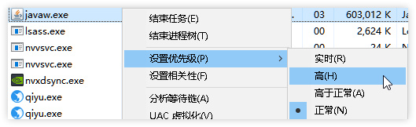
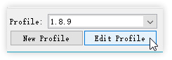
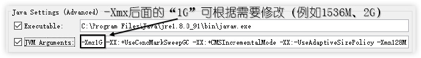
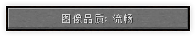
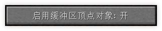
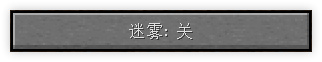
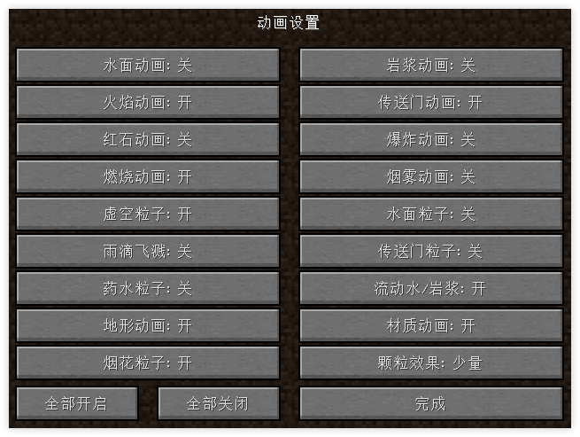
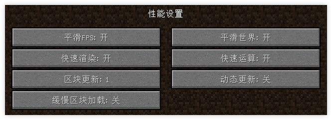

# 「优化」使你的 Minecraft 玩起来更流畅

虽然现在很多人都用上了高端配置的电脑，但是还仍有一部分的人因为各种条件的限制，导致只能使用低端配置的电脑。  
本教程将会教大家通过一些方法，优化 Minecraft，使你的 Minecraft 玩起来更流畅。  
但是，如果你玩纯净版 Minecraft（无任何模组，视距 4 左右），帧率小于 20，你也许就只能使用升级电脑硬件的方法了。  
本教程仅列举部分已知的方法。

---

## 方法一：关闭不必要的程序展开目录

程序会占用 CPU & 内存，开太多的话，会导致电脑运算效率下降，从而导致游戏卡顿。  
如果你需要听音乐，尽量使用手机或其他设备。

## 方法二：更新显卡驱动展开目录

新版的显卡驱动有可能会优化性能，如果有条件的话，就尽量更新一下。  
不过，有的显卡只能用特定版本的驱动，这样的话不建议更新，所以更新前最好去网上查一下相关资料。  
若需要下载驱动，最好到官网进行下载：

- [AMD](https://support.amd.com/zh-cn/download/)
- [NVIDIA](https://www.nvidia.cn/Download/index.aspx?lang=cn)
- [Intel](https://downloadcenter.intel.com/zh-cn)

如果你实在不会弄 / 嫌麻烦，就去下载驱动安装软件辅助安装（不建议）。

## 方法三：选择合适的 Java 运行时展开目录

Java 分 32 位和 64 位版本，如果你的系统是 64 位，就安装 64 位的 Java。  
查看电脑是多少位的系统：[百度经验](https://jingyan.baidu.com/article/5d6edee229af8b99eadeeca2.html)  
官方 Java 下载地址：[Java](https://www.java.com/zh_CN/download/manual.jsp)

## 方法四：把 Java 设置为 “高优先展开目录

**注意：本方法有一定的危险性（可能导致程序不稳定）。**   
在任务管理器中找到 Java 的进程，点击右键，把优先级设置为 “高”：

## 方法五：给 Java 分配更多的内存展开目录

本方法以正版启动器为例，其他的第三方启动器通常能在`启动器设置`​找到内存分配设置选项。  
**注意：内存只能分配** **​`小于`​**​ **当前系统剩余内存的大小。**

#### 步骤展开目录

1. 点击启动器左下角的 `Edit Profile`​ 按钮：  
    ​
2. 勾选 `JVM Arguments`​ 后，即可修改内容：  
    ​
3. 修改完成后，保存即可：  
    ​

## 方法六：安装 Optifine 展开目录

Optifine 是一个优化 Minecraft 的 MOD（模组），它提供了非常实用的功能，也解决了部分低配玩家玩 Minecraft 的卡顿现象。

**Optifine 下载地址**

- 国内：[MCBBS](https://www.mcbbs.net/forum.php?mod=viewthread&tid=142291)
- 国外：[官网](https://optifine.net/downloads)

**Forge 下载 &amp; 安装教程**

- [MCBBS](https://www.mcbbs.net/forum.php?mod=viewthread&tid=63718)
- [百度贴吧](https://tieba.baidu.com/p/2996506368)

## 方法七：进行适当的设置展开目录

> 注意：使用本方法请先安装 Optifine。

#### 方法展开目录

适当地调低视野距离（视频设置）

把 `图像品质`​ 设置为 `流畅`（视频设置）

启用缓冲区顶点图像（视频设置）

关闭迷雾（视频设置）

关闭一些动画效果（视频设置 - 动画）

修改 `性能设置`（视频设置 - 性能）

‍
