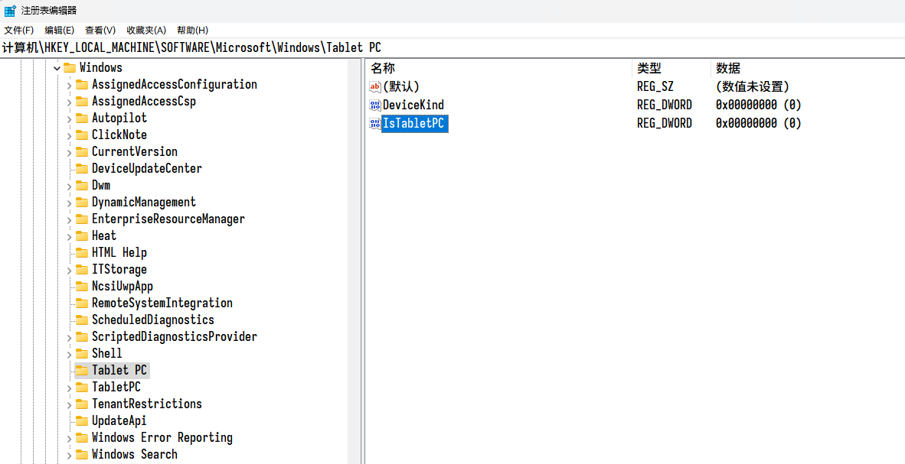
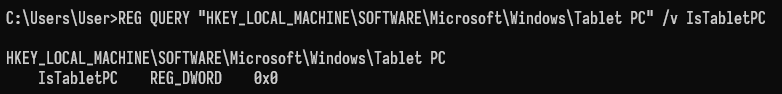

# Electron 或 Node.js 判断当前设备是否支持触摸屏

在 Windows 系统上，可以通过注册表项 `HKEY_LOCAL_MACHINE\SOFTWARE\Microsoft\Windows\Tablet PC\IsTabletPC` 获取当前设备是否支持触摸屏。

若 `IsTabletPC` 的值大于 `0`，则表示支持触摸屏。



执行以下命令，可以查询到对应的注册表信息：

```text
REG QUERY "HKEY_LOCAL_MACHINE\SOFTWARE\Microsoft\Windows\Tablet PC" /v IsTabletPC
```



在 Node.js 中，可以通过执行上述命令，检测返回内容的方式，判断当前设备是否支持触摸屏（除了使用命令以外，还可以使用 [regedit](https://www.npmjs.com/package/regedit) 模块来获取注册表信息）。

示例代码：

```javascript
const cp = require('child_process');
const os = require('os');

/** 通过注册表信息检测当前设备是否支持触摸屏 */
function isTabletPC() {

  if (os.platform() !== 'win32') {
    throw new Error('仅支持 Windows 系统');
  }

  try {

    // 命令返回内容：
    //   HKEY_LOCAL_MACHINE\SOFTWARE\Microsoft\Windows\Tablet PC
    //   IsTabletPC    REG_DWORD    0x0

    // 命令内容
    let cmd = 'REG QUERY "HKEY_LOCAL_MACHINE\\SOFTWARE\\Microsoft\\Windows\\Tablet PC" /v IsTabletPC';

    // 执行命令，转换返回内容为字符串
    let result = cp.execSync(cmd).toString();

    // 匹配：IsTabletPC    REG_DWORD    0x0
    let matched = result.match(/IsTabletPC\s+REG_\w+\s+([0-9a-fx]+)/i);

    // 提取：0x0
    let value = parseInt(matched ? matched[1] : null);

    if (isNaN(value)) {
      throw new Error('处理命令返回内容失败');
    }

    return (value !== 0);

  } catch (error) {
    console.error('检测触摸屏失败：');
    console.error(String(error));
    return false;
  }

}
```
