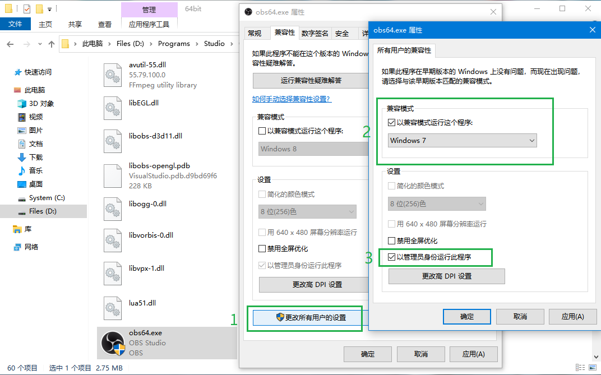
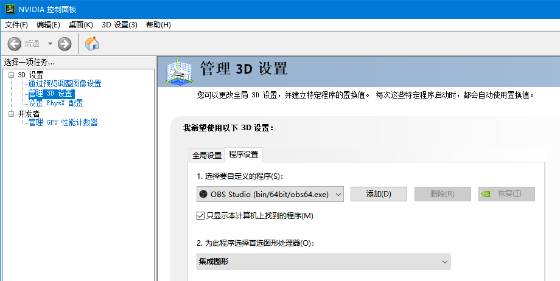
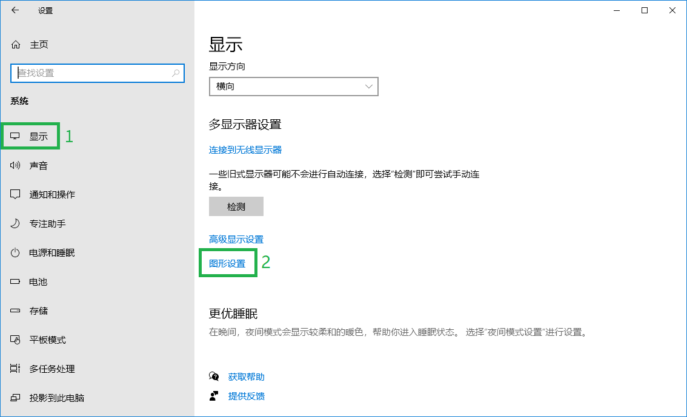
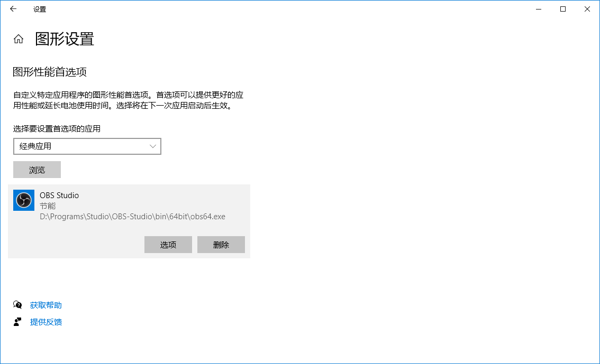
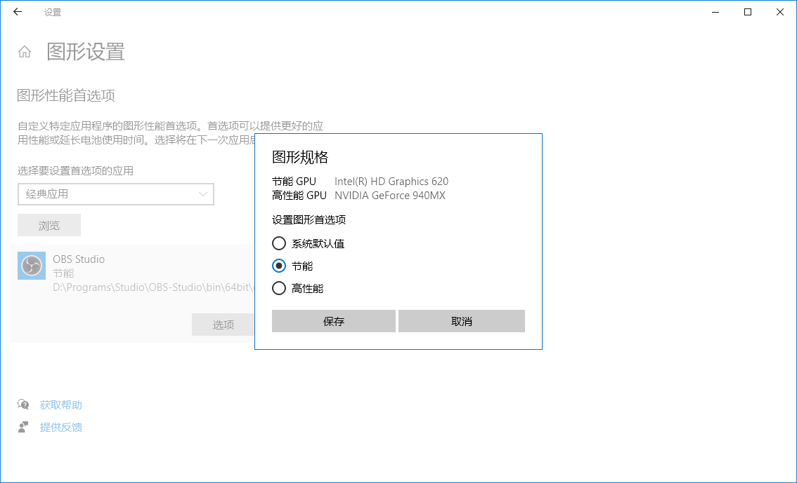

# 解决 OBS 显示器捕获黑屏的三个方法

使用双显卡时（例如 Intel 核显 + NVIDIA 独显的笔记本电脑），在 OBS 中添加“显示器捕获”，其中没有显示内容（空白）。

可能的原因：系统当前使用的显卡与 OBS 使用的显卡不一致

---

## 注意

- 本教程基于 Windows 10 系统。
- 使用以下方法之前，请确认已正常安装显卡驱动，且 OBS 未在运行。
- 建议先单独使用三个方法的其中一个方法（我使用的是方法三），若不成功再尝试组合使用。

## 方法一（兼容模式）

- 找到 OBS 的可执行文件：

  - 32位：`OBS安装路径\bin\32bit\obs32.exe`​
  - 64位：`OBS安装路径\bin\64bit\obs64.exe`​
- 右键点击 `可执行文件`，点击“属性”
- 根据图中的标出的内容修改设置，并点击“确定”  
  ​
- 运行 OBS

## 方法二（首选图形处理器）

- 打开显卡控制面板（以 NVIDIA 控制面板为例）
- 切换到：3D 设置 - 管理 3D 设置 - 程序设置
- 在“选择要自定义的程序”中找到“OBS”（若没有，点击右侧的“添加”按钮进行添加，文件路径可参考“方法一”）
- 在“为此程序选择首选图形处理器”中选择“集成图形”，并点击“应用”  
  ​
- 运行 OBS

## 方法三（图形性能首选项）

- 打开系统的“设置”
- 进入：系统 - 显示 - 图形设置  
  ​
- 点击“浏览”，添加 OBS 的可执行文件（文件路径可参考“方法一”）  
  ​
- 点击“选项”，选择“节能”，并点击“保存”  
  ​
- 运行 OBS

‍
