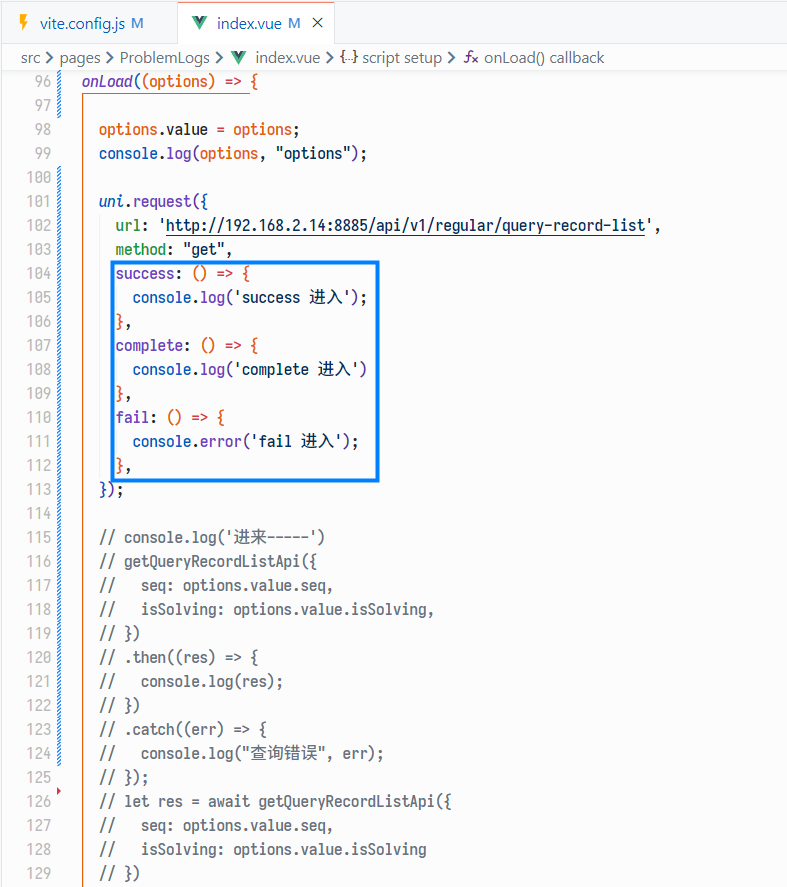
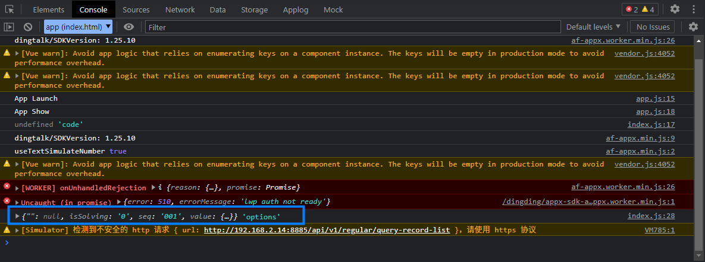
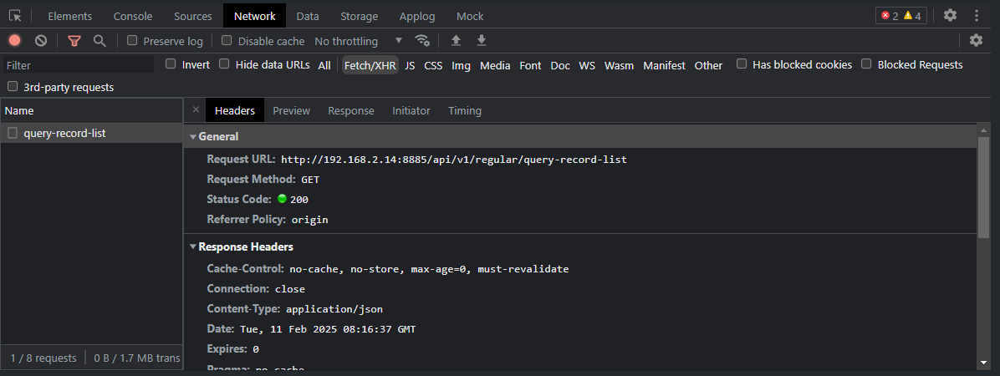
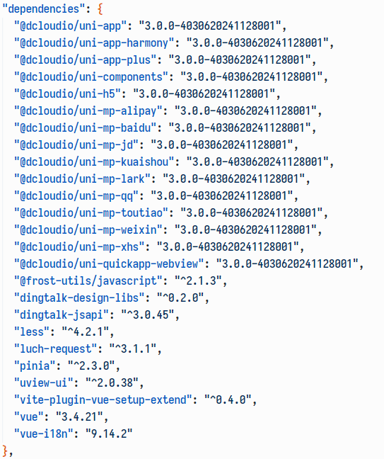
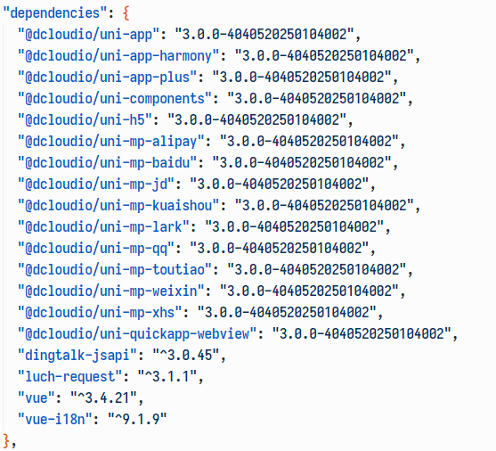
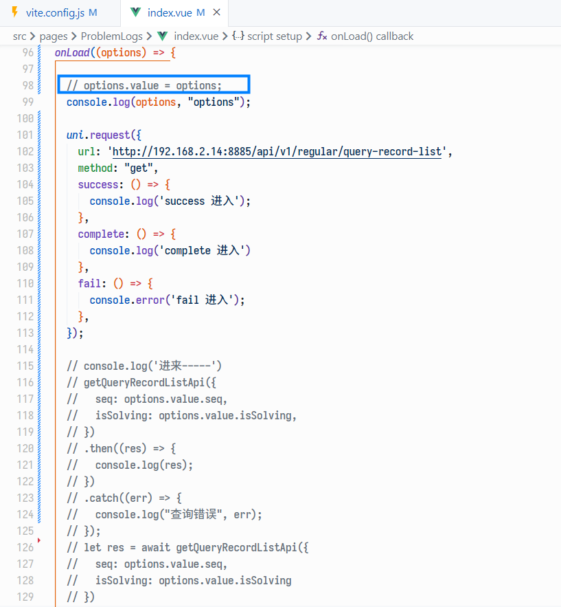
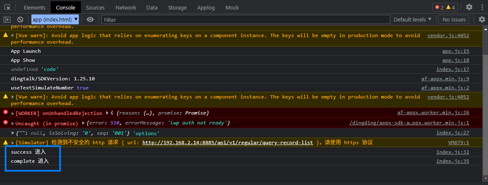

# 在用 uni-app 开发钉钉小程序的时候遇到一个奇怪的问题，发送请求拿不到返回的数据

今天我一位同事说用 uni-app 新开发的钉钉小程序里发送请求拿不到返回的数据，看了下发现调试工具的“Network”栏里显示请求是发送成功的，也有返回数据，但是没触发请求的回调函数。

原本用的是 `luch-request`​ 这个库发送的请求，后来试了下 uni-app 内置的 `uni.request`​ 以及钉钉的 `dd.httpRequest` 都是一样不行。

再后来重新创建一个新的项目试了一下是可以的，就觉得是版本的问题，然而把依赖项的版本改成和新建的一样了也不行。

看来看去，最后发现原来是这个 `options.value = options`​ 导致的（刚开始试过在 `App.vue` 里写请求也不行就没怎么在意这里），把它去掉就正常了。

然后试了下在新创建的项目里写上这个 `options.value = options`，但是这个问题并没有出现。
