# 「教程」在 Termux 中安装任意版本的 JDK

## 简介

- 主要通过在 Termux 中安装系统的方式实现，本教程以安装 Ubuntu 系统为例。
- 本教程基于 MIUI 12（Android 11），并在 Mokee 100.0（Android 10）中测试通过。
- 本教程中可能会存在描述不准确的地方，欢迎各位在评论区中指出。
- 建议您在有一定的 Linux 命令行操作经验的情况下阅读本教程。
- 建议在开始阅读前先大致浏览一遍本教程的内容，了解大概步骤。

## 准备

### 软件下载

- [Termux - 本体](https://f-droid.org/zh_Hans/packages/com.termux/)
- [AnLinux - 获取系统安装脚本](https://f-droid.org/zh_Hans/packages/exa.lnx.a/)
- [MT管理器 - 管理文件，可用其他类似软件代替](https://coolapk.com/apk/bin.mt.plus)

### 相关链接

- [Adoptium（用于下载 JDK）](https://adoptium.net/)
- [离线安装系统用文件（密码：9hac）](https://frost-zx.lanzoul.com/b00p69g4b/)

## 启动 Termux & 安装相关的软件包

1. 启动 Termux，等待初始化完成（仅在第一次启动时）。
2. 执行 `pkg update`​ 命令，更新软件包信息。  
    可能会出现类似这样的提示，如果没有手动修改过提示中的文件，  
    可以输入 `Y`​，否则输入 `N`​，然后点击 `ENTER`​。  
    ​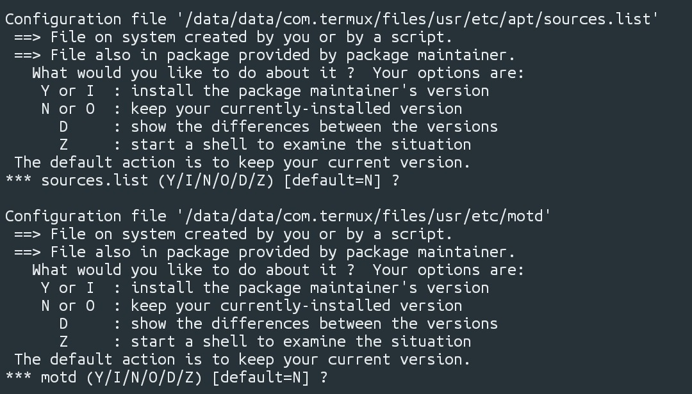
3. 执行 `pkg install openssl-tool proot vim wget -y` 命令，安装4个软件包。

## 安装系统

### 方式一、在线安装

> 此方式需要访问位于海外的服务器，因此对网络环境的要求较高。  
> 如果网络不稳定，建议参考离线安装方式进行操作。

1. 打开 AnLinux，选择需要安装的系统。  
    ​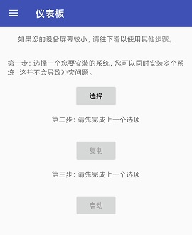
2. 复制软件给出的安装命令。  
    ​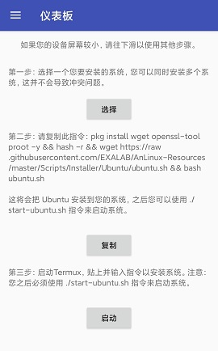
3. 在 Termux 中执行 `cd ~`​ 命令，切换工作目录到 `home`​ 文件夹。  
    然后粘贴复制的命令，等待脚本自动完成安装操作。  
    如果网络状况不稳定，可能会出现安装失败或文件下载失败的情况。  
    一般来说，如果在输出的内容中已经出现 `Resolving...`​、`Connecting...`​ 之类的提示，则表示命令前方部分的 `pkg install`​ 部分已执行成功，但在后方部分的 `wget`​ 下载安装脚本或 Rootfs 文件的过程中出现错误。  
    ​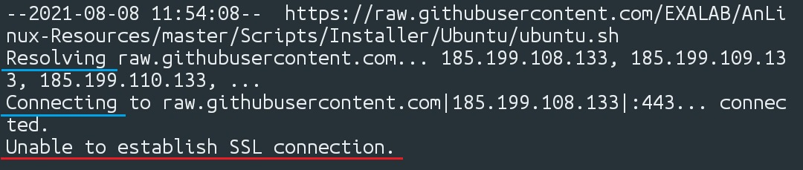  
    ​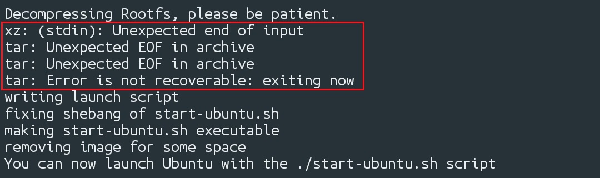  
    如果文件下载失败（输出的内容中有类似 `Connection timed out`​、`Unable to establish connection`​、`Unexpected EOF in archive`​ 的提示），则执行 `ls -a`​ 命令，查看是否存在 `start-ubuntu.sh`​、`ubuntu.sh`​、`ubuntu-rootfs.tar.gz`​、`ubuntu-binds`​、`ubuntu-fs`​ 这几个文件（文件夹）。如果存在则执行 `rm -rf <文件名>`​ 命令将其删除（也可以直接执行 `rm -rf *ubuntu*`​ 命令），才能再次执行复制的命令，否则可能会被误认为文件已经下载完成或出现其他问题。  
    ​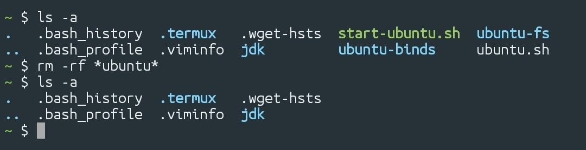
4. 如果文件下载完毕且安装成功，则会出现类似这样的提示：  
    ​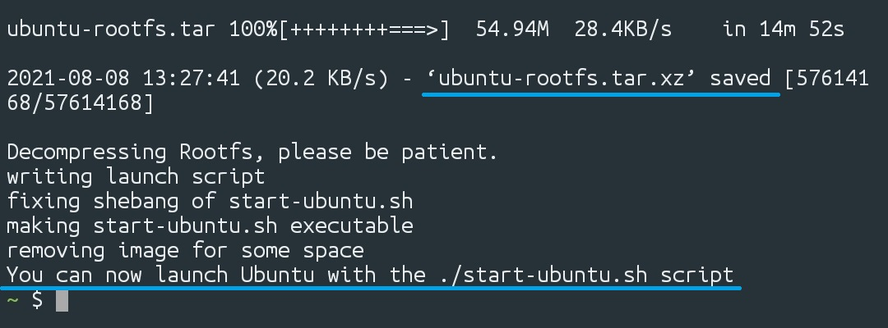

### 方式二、离线安装

1. 打开 AnLinux，点击侧边栏中的“下载 Rootfs（离线用途）”。  
    ​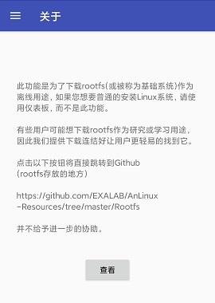
2. 点击界面中的“查看”按钮，跳转到下载页面。  
    ​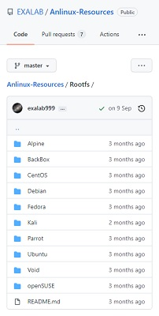
3. 根据所需要安装的版本和 CPU 架构，进入对应的文件夹。

    > 目前手机 CPU 的架构一般为 64 位 ARM。  
    > 对于 Ubuntu 系统，路径为 `Anlinux-Resources/Rootfs/Ubuntu/arm64/`。
    >

    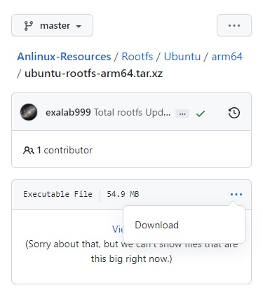
4. 点击文件 `ubuntu-rootfs-arm64.tar.xz`，进入详情页面，然后点击“Download”按钮进行下载。

    > 本教程中使用的文件的更新日期为 **2021-08-14**。
    >
5. 进入 `Anlinux-Resources/Scripts/Installer/` 文件夹，下载对应系统的安装脚本。

    > Ubuntu 系统的安装脚本路径为 `Anlinux-Resources/Scripts/Installer/Ubuntu/ubuntu.sh`​。  
    > 本教程中使用的文件的更新日期为 **2020-01-15**。
    >

    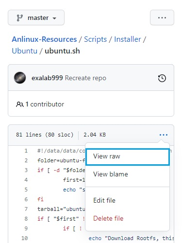
6. 将下载好的安装脚本和 Rootfs 文件移动到任意位置放好（也可以不移动）。  
    ​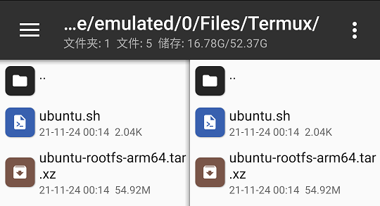
7. 点击安装脚本（ubuntu.sh），选择“编辑”，查看 Rootfs 的文件名。  
    ​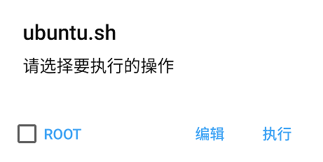  
    ​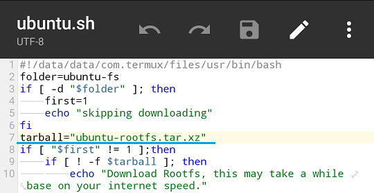
8. 重命名 Rootfs 文件名，与脚本中的一致。  
    ​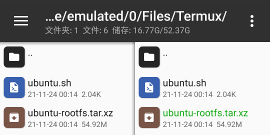
9. 执行 `cp <源路径> <目标路径>` 命令，复制 Rootfs 文件和安装脚本到 Termux 中。

    > 注：  
    > 执行 `cp`​ 命令前可以先执行 `cd`​ 命令切换工作目录；  
    > 建议执行 `cd ~`​ 命令，回到 `home`​ 目录，方便后续操作。  
    > 命令中的 `.` 表示执行命令时的工作目录。
    >

    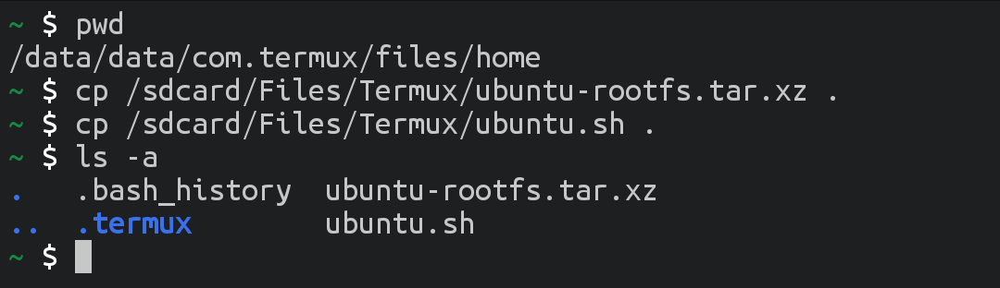
10. 执行 `bash <安装脚本文件名>`​ 命令，调用脚本，安装系统。  
     ​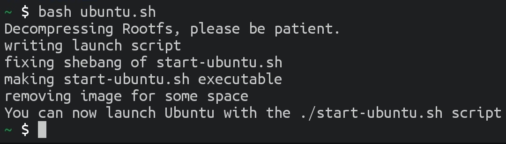

## 进入 Ubuntu 系统

1. 如果需要挂载手机的内部储存到 Ubuntu 中，可以按以下步骤修改 Ubuntu 的启动脚本。

    > **建议修改，方便传输文件。**
    >

    执行 `vim ~/start-ubuntu.sh`​ 命令，打开编辑器：  
    ​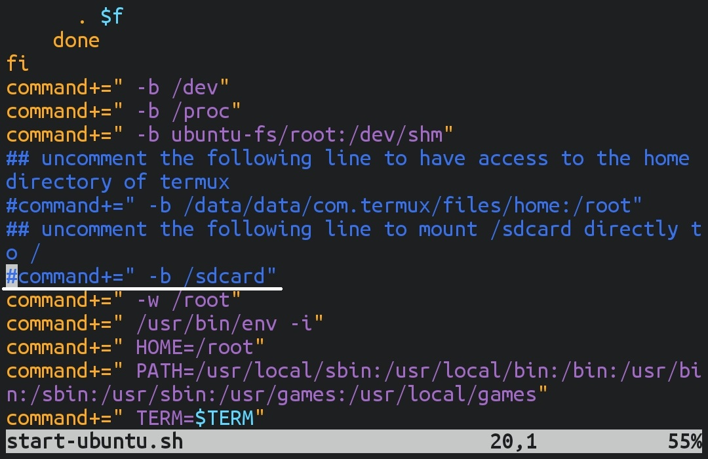  
    点击 `i`​ 键，进入插入模式，然后将第 20 行前的 `#`​ 删除（取消注释）：  
    ​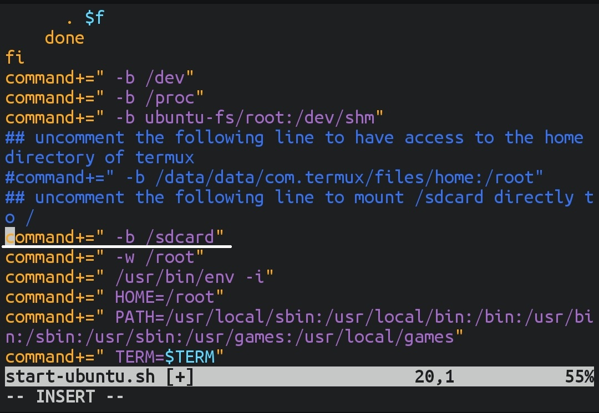  
    点击 `ESC`​，输入 `:wq`​，点击 `ENTER`​，保存并关闭文件：  
    ​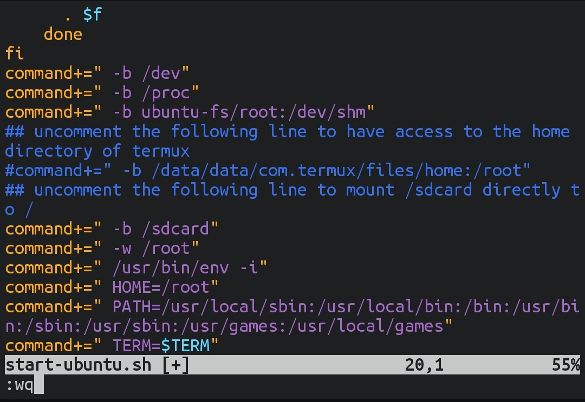
2. 然后就可以执行 `bash ~/start-ubuntu.sh` 命令，进入安装的 Ubuntu 系统了。

    > 注：  
    > 如果当前的工作目录为 `home`​，可以执行 `./start-ubuntu.sh`。  
    > 下一次打开 Termux 时也是通过执行此命令进入 Ubuntu 系统。
    >

    
3. 进入系统后，执行一次 `apt update` 命令，更新软件包信息。

    > 如果有需要，可以继续执行 ｀apt upgrade\` 命令更新软件包。
    >
4. 执行 `apt install vim` 命令，安装 Vim。

## 安装 JDK

### 方式一、安装 Ubuntu 软件源中的 JDK

1. 执行 `apt search openjdk` 命令，查看可安装的 JDK 版本。
2. 如果需要安装 OpenJDK 8，则执行 `apt install openjdk-8-jdk-headless`。

    > 因为不使用图形化界面，所以安装 headless 版本即可。
    >
3. 安装完成后，执行 `java -version` 命令进行验证。

### 方式二、从 Adoptium 网站下载 JDK

#### 下载文件

1. 访问 Adoptium 网站。
2. 点击“Other platforms”，然后选择所需要的版本。  
    ​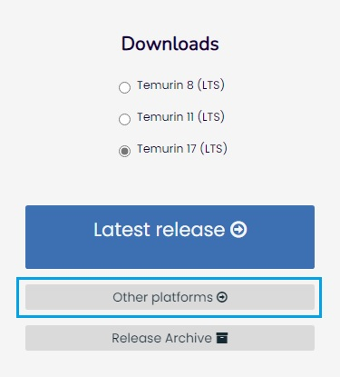  
    ​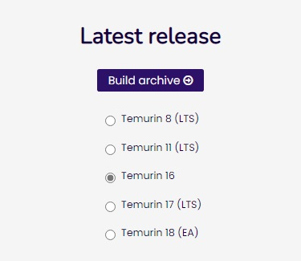
3. 选择操作系统和 CPU 架构

    > 操作系统：Linux  
    > CPU 架构：32位 - arm32 / 64位 - aarch64
    >

    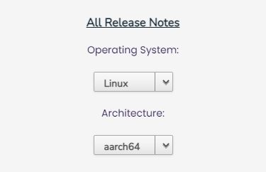
4. 点击列表项右侧的图标进行下载。

    > 部分可以选择下载 JDK 或 JRE 版本，如果只是需要 Java 运行环境（例如开 Minecraft 服务器），可以下载 JRE 版本。
    >

    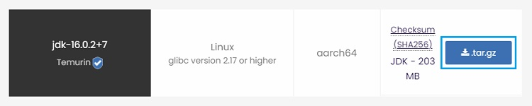

#### 安装 & 设置环境变量

> 注：如无特殊说明，以下在 Termux 中进行的操作均在安装的 Ubuntu 中进行。

1. 将下载好的 JDK 文件移动到任意位置放好（也可以不移动）。  
    ​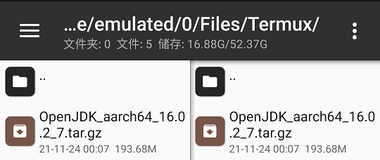
2. 在 Termux 中执行 `cd`​ 命令切换工作目录（例如 `cd ~`​）；  
    然后执行 `mkdir <文件夹名称>`​ 命令创建用于放置 JDK 的文件夹；  
    然后执行 `cd <文件夹名称>` 命令切换工作目录到创建的文件夹。
3. 执行 `cp <源路径> <目标路径>` 命令，把下载的 JDK 文件复制到 Ubuntu 中。

    > 例如 `cp /sdcard/Files/OpenJDK_16.tar.gz .`​  
    > 注：`/sdcard` 为手机的内部储存挂载路径，需要修改 Ubuntu 启动脚本才能使用。
    >

    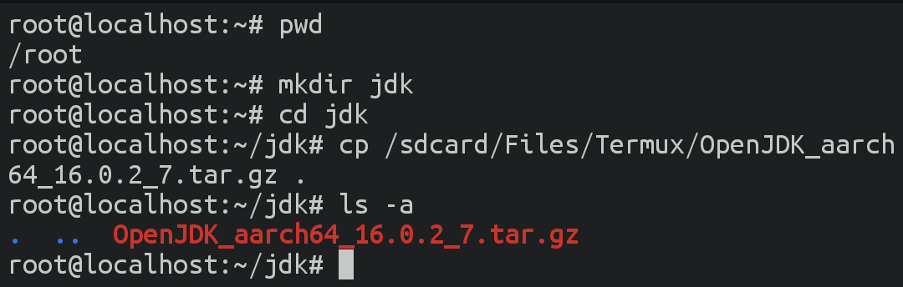
4. 执行 `tar -xzf <文件名>`​ 命令，解压文件。  
    ​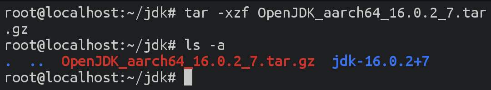
5. 执行 `mv <文件夹名称> <目标名称>` 命令，重命名 JDK 文件夹。

    > 主要是方便使用，不一定需要重命名。
    >

    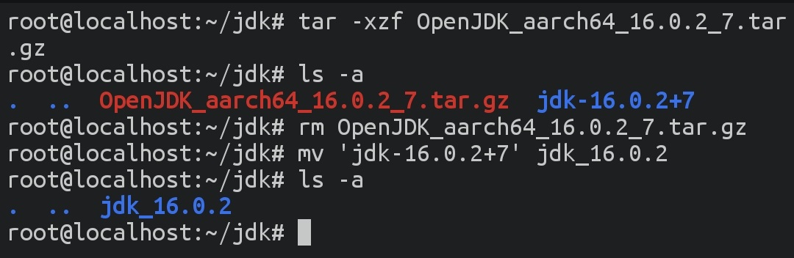
6. 执行 `cd <文件夹名称>/bin/`​ 命令，将工作目录切换到 JDK 的 `bin`​ 文件夹。  
    然后执行 `ls -al`​ 命令，查看其中的文件是否有可执行权限（左侧的权限属性有三个 `x`​）。  
    一般情况下，该权限在 JDK 文件打包前已经被设置，解压时会自动识别。  
    如果没有，可以在当前文件夹执行一次 `chmod +x *`​ 命令。  
    ​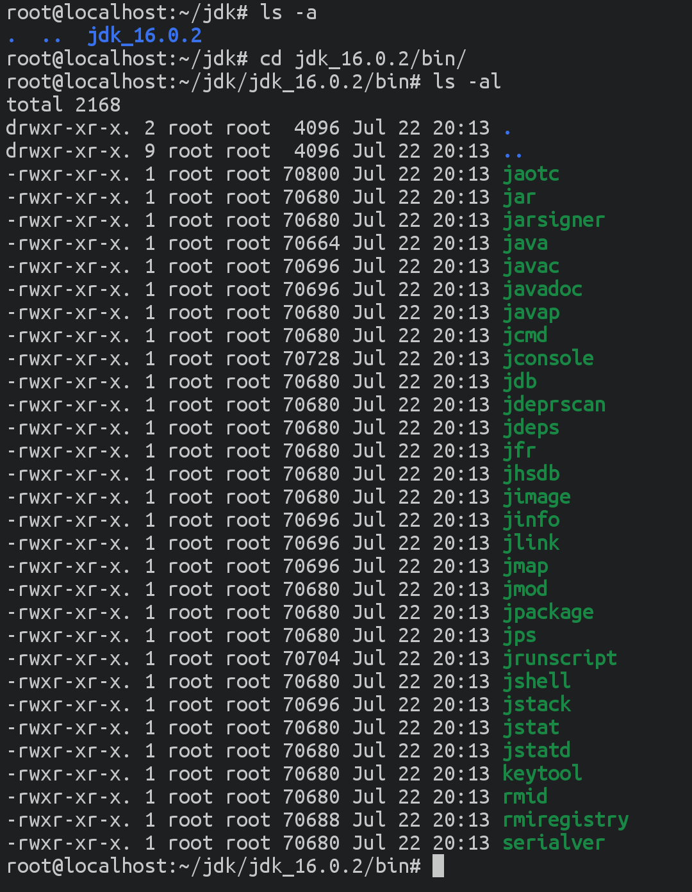
7. 执行 `./java -version`​ 命令，测试是否能出现对应的版本号。  
    ​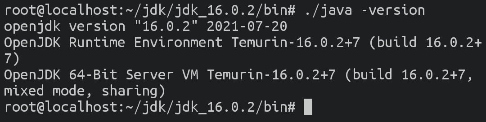
8. 执行 `vim ~/.bash_profile`​ 命令（也可以先 `cd ~`​ 再 `vim .bash_profile`​），  
    打开“home”目录下的 `.bash_profile` 文件，设置环境变量。  
    默认情况下，应该没有这个文件，将会在保存后自动创建。

    ```bash
    export JAVA_HOME=~/jdk/jdk_16.0.2
    export PATH=$PATH:$JAVA_HOME/bin
    ```

    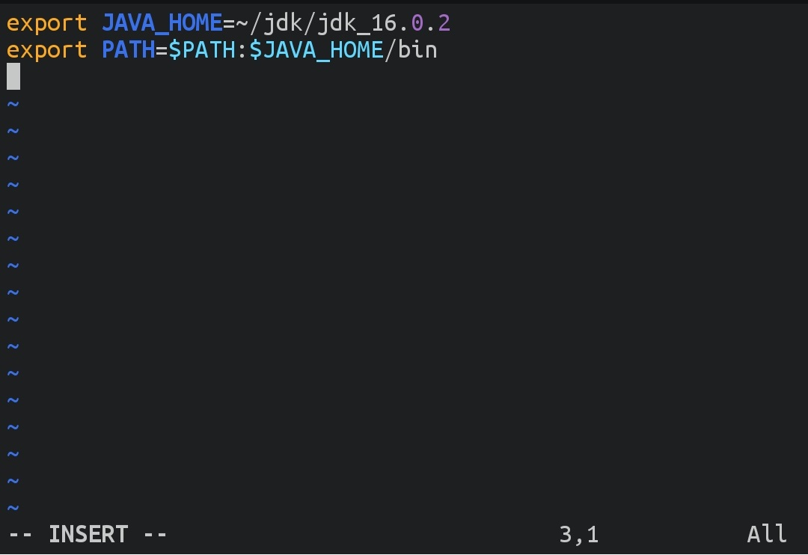  
    ​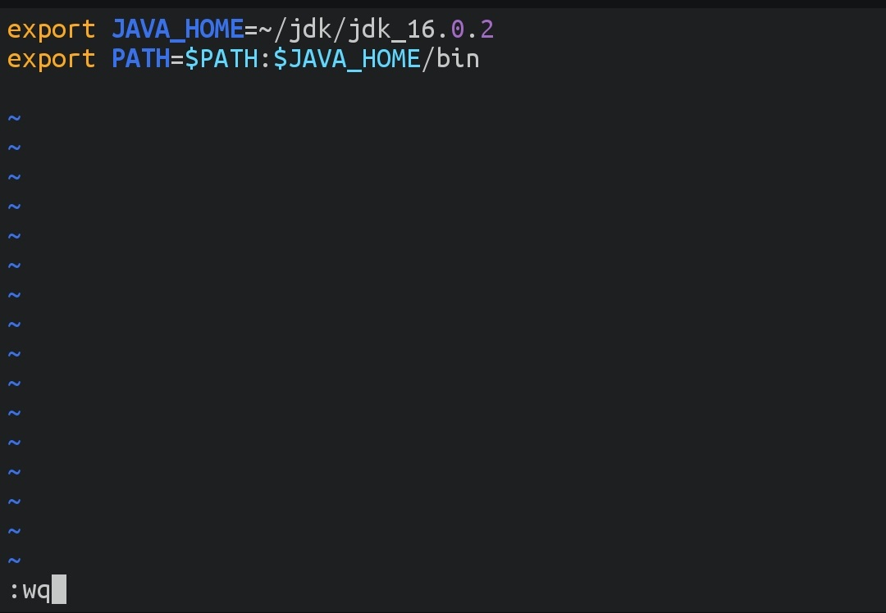
9. 保存后，执行 `exit`​ 命令退出 Ubuntu 系统，  
    然后再执行 `bash ~/start-ubuntu.sh`​ 命令，重新进入 Ubuntu 系统。  
    ​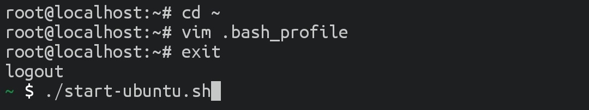
10. 此时执行 `java -version`​ 命令，有显示对应的版本号则安装成功，否则检查环境变量是否设置正确。  
     ​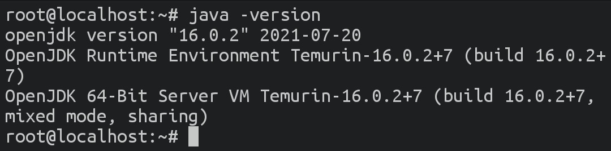

## 注意事项

- 因为该 JDK 是在 Ubuntu 中安装的，所以需要进入 Ubuntu 后才能使用。
- 建议在关闭 Termux 前先执行 `exit` 命令退出系统。

## 补充内容

### Termux

- 在系统的通知栏中点击 Termux 通知的“Acquire wakelock”（使用完毕后点击“Release wakelock”），并在“最近任务”中锁定 Termux，可防止 Termux 被系统关闭。  
  ​
- 安装“Termux:Styling”（可在 F-Droid 上下载）后可以调整 Termux 的样式。

### Ubuntu

- 如果需要同时使用多个会话，可以安装 `screen`​ 软件包（`apt install screen`）。

### Vim 操作提示

- 打开编辑器时，默认是“正常模式”，点击键盘上的“i”可进入“插入模式”（此时左下角会显示“INSERT”），然后就可以编辑内容。进入“插入模式”后，点击“ESC”可回到“正常模式”。
- 点击“上”“下”“左”“右”箭头可以移动光标。
- 在“正常模式”下，点击键盘上的“u”可以进行撤销操作。
- 在“正常模式”下，输入“:wq”，按下“回车”键，保存并关闭文件（输入“:w”，仅保存；输入“q”，仅退出；输入“:q!”，不保存并关闭）。

‍
