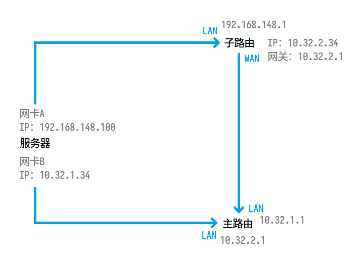

# 记一次 Ubuntu 20.04 双网卡配置过程

## 情况说明

现有如图所示的网络结构（非专业网络拓扑图，仅供参考）



其中：

- 主路由有两个 DHCP 服务器（IP 为 10.32.1.1 和 10.32.2.1）。
- 子路由设置了 DMZ 主机，指向服务器（192.168.148.100）。
- 网卡A - `enp6s0`，网卡B - `ens4`。

注意：

- 一台主机只配置一个默认网关，若有多个，会自动选择优先级较高的一个进行通信。

  因此，需要手动给网卡配置静态路由。

## 要求

- 服务器可以访问子路由、主路由，以及外网。
- 连接到主路由的设备能通过 IP 10.32.1.34 和 10.32.2.1 访问服务器。

## 参考资料

- [Netplan](https://netplan.io/reference/)

## 用到的命令

```text
ip a
sudo netplan apply
sudo service systemd-networkd restart
sudo ip route show
sudo netstat -rn
traceroute -m 10 -n www.baidu.com
```

## 配置

修改 `/etc/netplan/00-installer-config.yaml`（文件名不一定是这个）

### 方案一

服务器通过主路由访问外网

```yaml
network:
  renderer: networkd
  ethernets:
    ens4:
      dhcp4: true
    enp6s0:
      dhcp4: false
      addresses: [192.168.148.100/24]
      routes:
        - to: 192.168.148.0/24
          via: 192.168.148.1
        - to: 10.32.2.0/24
          via: 192.168.148.1
  version: 2
```

### 方案二

服务器通过子路由访问外网

> 一般来说，使用方案一就可以了（已测试），但在部分网络环境下需要使用方案二这样的配置（原因未知，猜测可能与路由器设置有关）。

```yaml
network:
  renderer: networkd
  ethernets:
    ens4:
      dhcp4: false
      addresses: [10.32.1.29/24]
    enp6s0:
      dhcp4: true
      routes:
        - to: 192.168.148.0/24
          via: 192.168.148.1
  version: 2
```

‍
