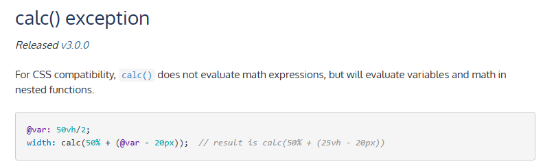
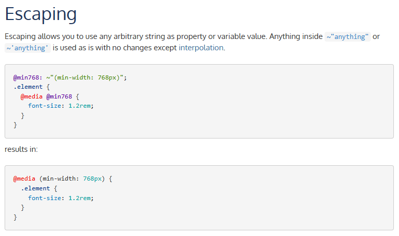

# 在 Less 中使用与 Less 内置函数同名的原生 CSS 函数

## 参考资料

- [calc() - CSS：层叠样式表 | MDN](https://developer.mozilla.org/zh-CN/docs/Web/CSS/calc)
- [Getting started - Escaping | Less.js](https://lesscss.org/#escaping)
- [Using The CSS Function calc() Inside The LESS CSS Preprocessor](https://www.bennadel.com/blog/4047-using-the-css-function-calc-inside-the-less-css-preprocessor.htm)

## 问题描述

在原生 CSS 中有以下的函数：`calc()`​、`max()`​、`min()` 等，而在 Less 中也有同名的函数，使用的时候可能会冲突，无法得到需要的结果。

对于 `calc()`，Less 进行了处理，不会对数学表达式进行计算。



但如果其中包含变量或嵌套的函数，则会进行计算。例如 `calc()`​ 和 `max()` 嵌套使用的时候：

```css
.element {
  width: calc(max(var(--min-width), var(--item-width) + var(--offset-width)) * 1px);
}
```

会出现以下报错：

```text
[less] Error evaluating function `max`: Operation on an invalid type
```

## 如何解决

这时可以使用 Less 的转义字符：在字符串前加上一个 `~`​ 符号，并将需要转义的字符串放在 `""`​ 或 `''` 中。



```css
.element {
  width: ~"calc(max(var(--min-width), var(--item-width) + var(--offset-width)) * 1px)";
}
```

这样就可以使用任意的字符串作为属性或变量值了（当然，前提是使用正确的 CSS 语法）。
