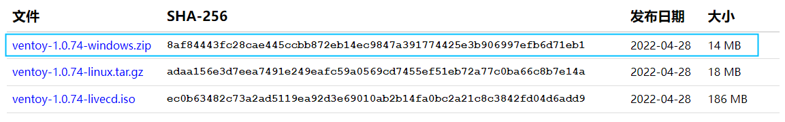
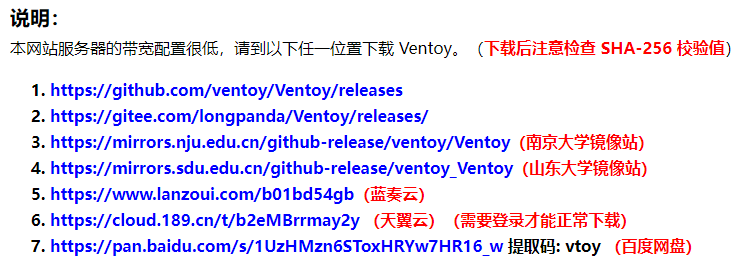
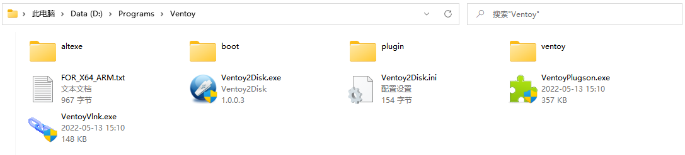
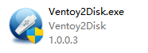
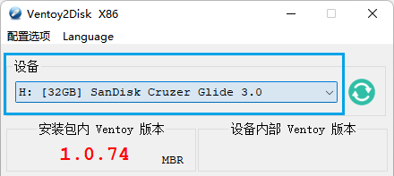
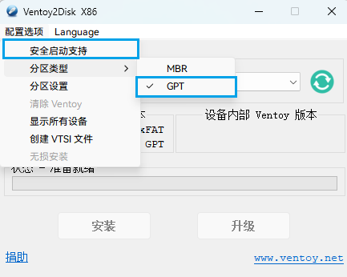
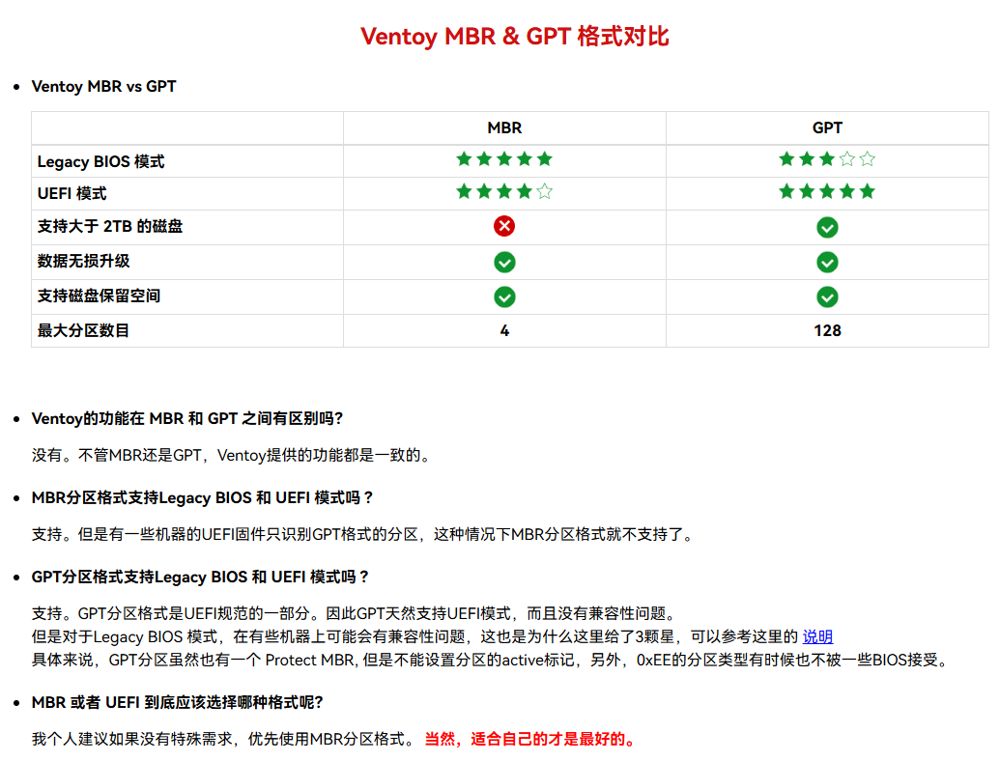
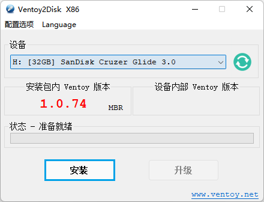
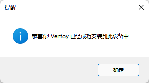
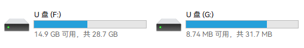

# 使用 Ventoy 工具制作U盘启动盘

## 简介

主要使用 [Ventoy](https://www.ventoy.net/) 工具制作，支持引导多个镜像。本文以 **Windows** 平台为例进行说明和演示。

## 操作步骤

### 一、下载 Ventoy 工具

1. 访问 Ventoy 官网的下载页面：[Download · Ventoy](https://www.ventoy.net/cn/download.html)
2. 根据当前的系统类型下载对应的文件。例如 Windows 系统，则下载 `ventoy-版本号-windows.zip` 文件：

    

    原地址的下载速度可能比较慢，建议从页面下方的镜像地址下载：

    ​​
3. 将下载的文件解压到任意位置（建议文件路径不包含空格或中文）：

    

### 二、连接U盘

将需要制作为启动盘的U盘与电脑连接。

**注意：工具会将U盘的数据清空，请操作前先备份U盘中的文件。**

### 三、启动 Ventoy 工具

1. 运行文件夹中的 `Ventoy2Disk.exe`。

    
2. 在“设备”中选择需要使用的U盘。

    **注意：请确保选择正确的设备。**

    
3. 根据需要，调整工具的配置选项。

    

    
4. 点击“安装”。

    

    等待片刻后，如无意外会弹出“安装成功”提示框。

    

    此时可以关闭 Ventoy 工具。

### 四、放置需要使用的镜像文件到U盘

在“资源管理器”中打开U盘，将需要使用的 ISO 镜像文件复制到其中。

**注意：**

Ventoy 工具在U盘中创建了一个用于 BIOS 引导的分区（大小为 32MB 左右），Windows 10 上的资源管理器可能会显示该分区，复制文件时需要注意，应复制到空间**较大**的分区。

‍
