# 使用 VSCode 查看和编辑 Minecraft 存档的 NBT

## 简介

目前已知常用的 NBT 数据编辑工具有 NBTExplorer、Universal Minecraft Editor、webNBT 等，但他们目前都不太兼容 Minecraft 1.12.2 以上版本的存档。

实际上，除了使用上述的几款工具以外，还可以使用 VSCode 编辑 NBT 数据。主要用到**由 Misode 开发的 NBT Viewer 扩展**（[misode/vscode-nbt: NBT extension for VSCode](https://github.com/misode/vscode-nbt)）。本文将会从 VSCode 的安装开始讲述使用方法。

## 一、安装 VSCode

1. 访问 VSCode 官网（[code.visualstudio.com](https://code.visualstudio.com/)），点击页面左侧的下载按钮，下载自动识别的版本，或点击 “other platforms”，根据实际情况下载合适的版本。

    > 注：若下载速度较慢，可参考文末中的 “VSCode 安装包下载太慢” 解决方法。
    >

    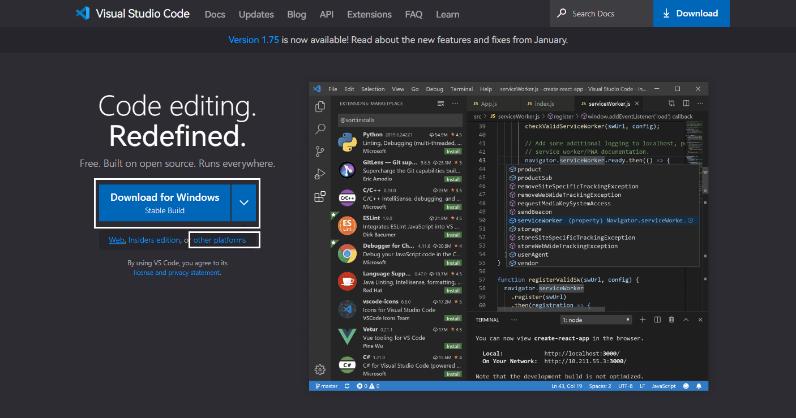  
    本文中以 Windows 平台 `System Installer`​ `x64`​ 为例。  
    ​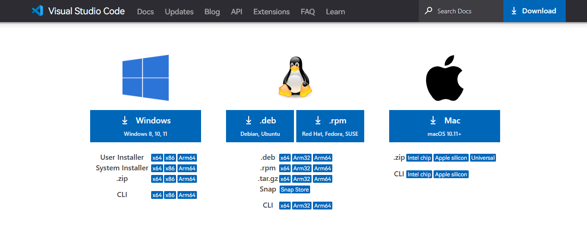  
    若有需要，可以访问 “[Setting up Visual Studio Code](https://code.visualstudio.com/docs/setup/setup-overview)” 页面查看安装说明文档（英文）：  
    ​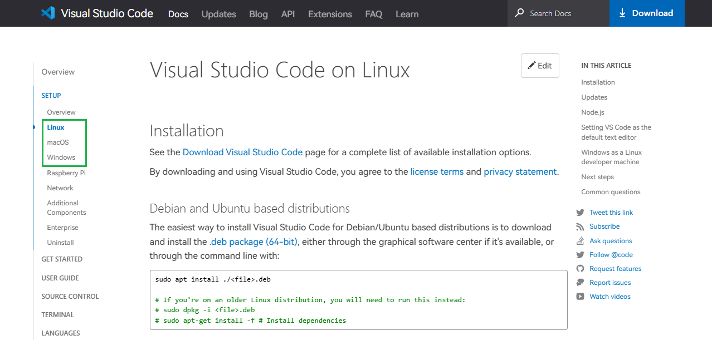
2. 下载完成后，双击运行安装程序以开始安装。  
    ​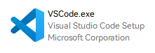
3. 根据提示进行相关操作，直到安装完成：  
    ​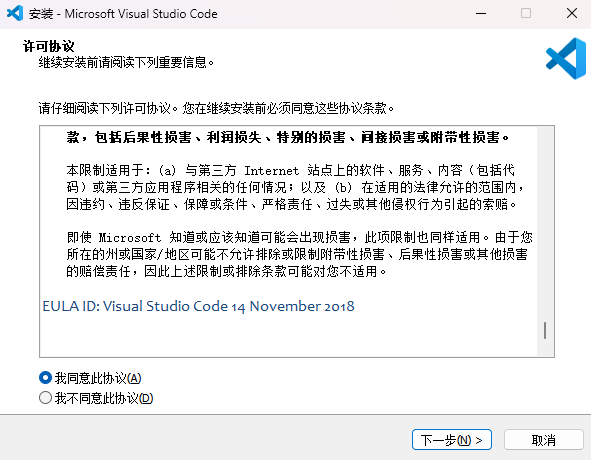  
    ​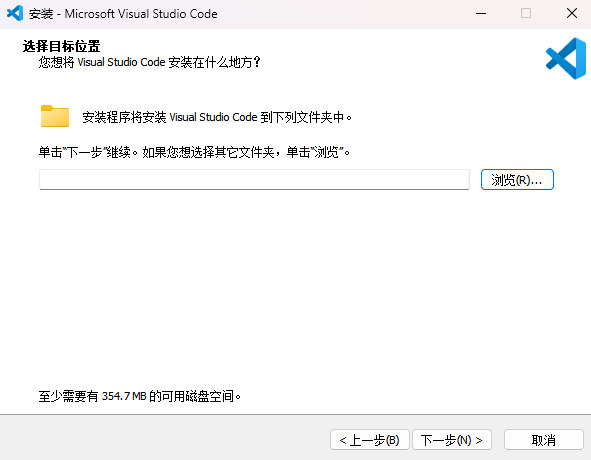  
    ​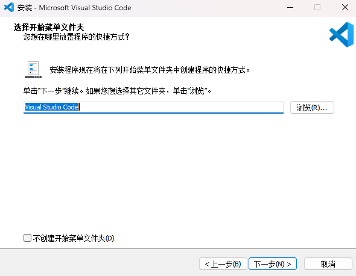  
    ​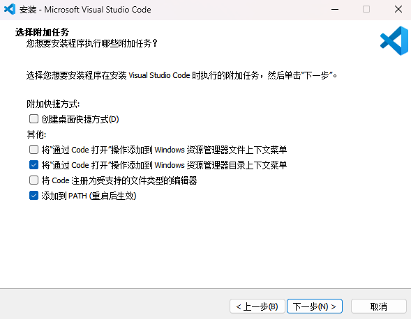  
    ​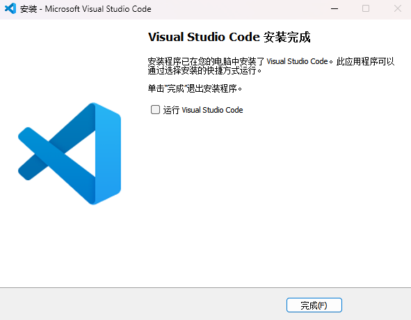

## 二、安装语言包

在系统菜单或桌面中找到 VSCode，运行。初次启动时，软件右下角会根据当前系统语言设置，提示安装对应的语言包。若点击 “安装并重启” 按钮，软件将会自动安装语言包并重启。

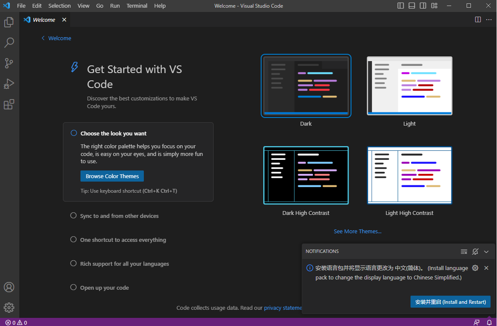

---

若有需要，可以按下 `Ctrl + Shift + P`​ 或 `F1`，输入 “display language”，选择 “Configure Display Language”，然后选择安装所需的语言包。

> 注：使用 `↑`​ `↓`​ 键切换选项，按下 `Enter` 键进行确认。

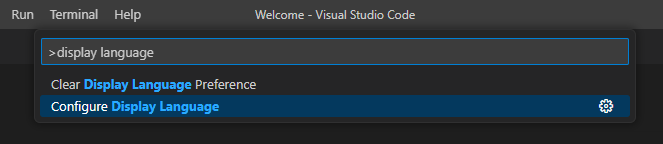

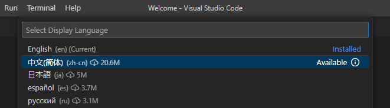

选择语言后，会提示需要重启以生效。若点击 “Restart” 按钮则自动重启，若点击 “Cancel” 按钮则可以在稍后手动重启。

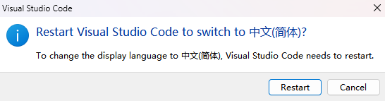

## 三、更改默认设置和主题

若有需要，可以先对软件的默认设置进行一些调整以及更换主题。

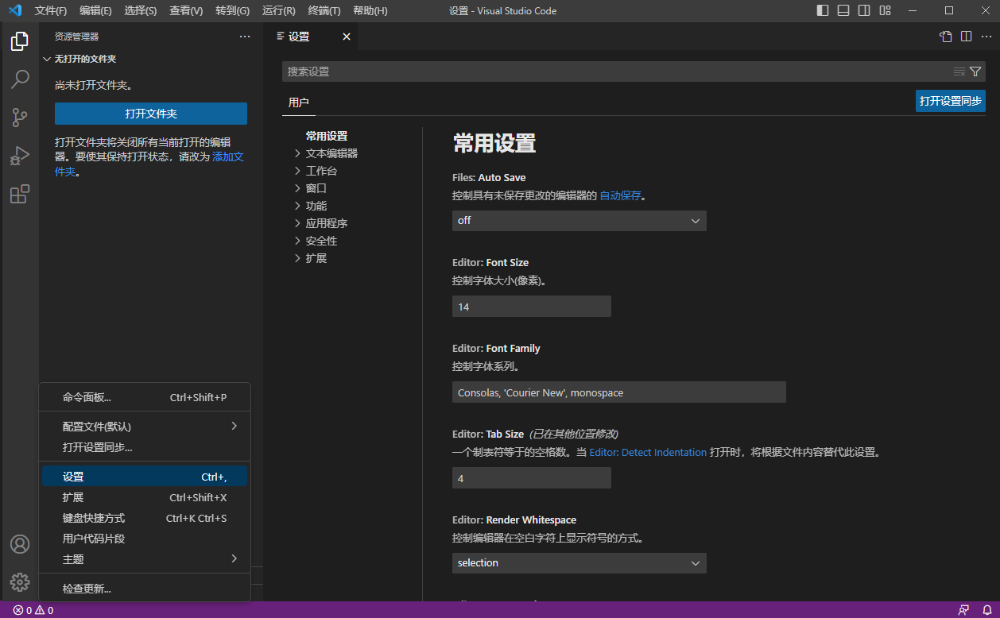

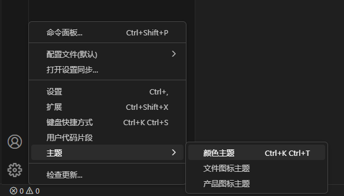

## 四、安装 NBT Viewer 扩展

点击左侧边栏中的 “扩展” 图标，然后在输入框中填写 “Misodee.vscode-nbt” 或 “NBT Viewer” 进行搜索。

> 若使用关键词 “NBT Viewer” 进行搜索，可能会有多个结果，请注意不要安装错。

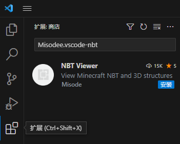

点击 “安装” 按钮，安装找到的 NBT Viewer 扩展。

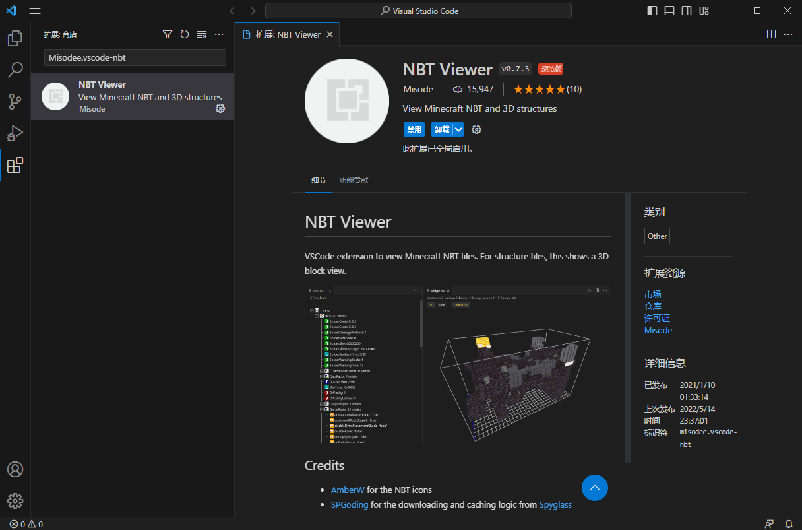

## 五、打开存档文件夹

点击左侧边栏中的 “资源管理器” 图标，然后点击 “打开文件夹” 按钮选择存档文件夹，或直接将存档文件夹拖动到左侧区域以打开。

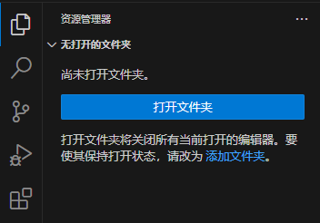

初次打开文件夹时会弹出 “信任文件夹” 对话框，根据需要选择即可（不影响 NBT Viewer 扩展的正常使用）。

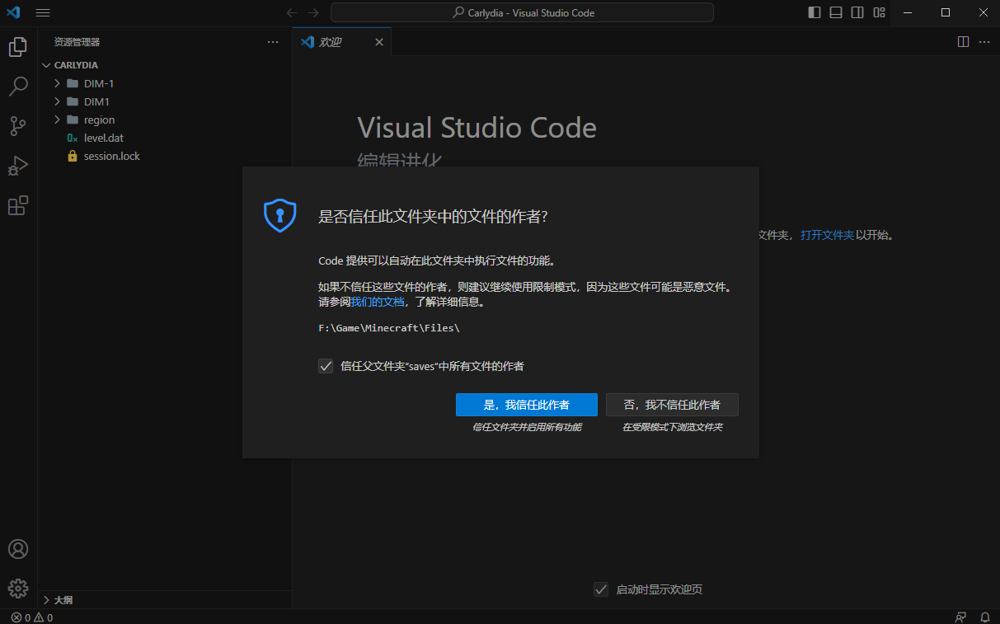

---

若有需要，可以按下 `Ctrl + Shift + P`​ 或 `F1`，输入 “workspace trust”，选择 “Manage Workspace Trust”，查看工作区信任配置情况。

> 注：使用 `↑`​ `↓`​ 键切换选项，按下 `Enter` 键进行确认。

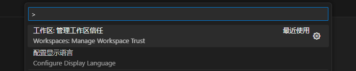

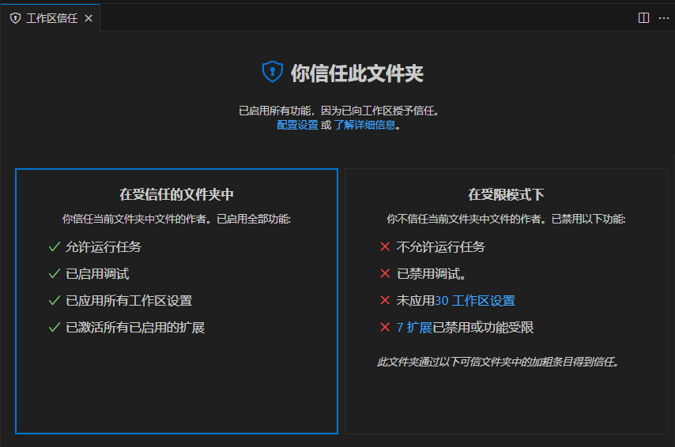

---

如果需要添加多个文件夹，可以通过将文件夹拖动到文件列表中，或选择菜单（工具栏 / 右键菜单）中的 “将文件夹添加到工作区” 项的方式进行添加。

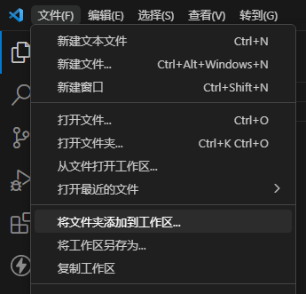

在弹出的对话框中选择 “将文件夹添加到工作区”。

## 六、查看和编辑 NBT 数据

单击左侧文件列表中文件项即可将其打开：

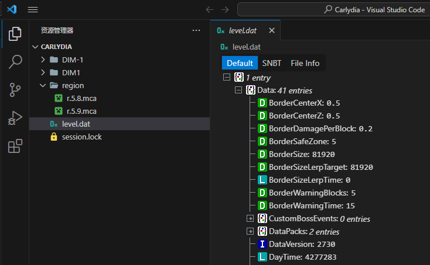

注意：通过 “单击” 方式打开的文件默认不保持打开，会在**打开其他文件时自动关闭**。通过 “双击” 方式打开，或点击文件标签页右键菜单中的 “保持打开状态” 项，可以把它变为 “保持打开”。

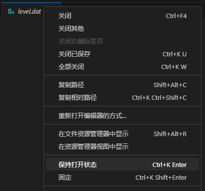

打开文件后，需要**等待 NBT Viewer 扩展从 GitHub 下载所需要的依赖文件后才能看到内容**。由于服务器在国外，**你可能需要使用网络加速工具以提高下载速度**。在 VSCode 的 “输出” 面板中可以看到详细情况：

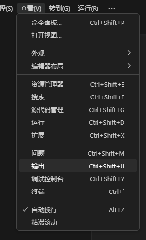

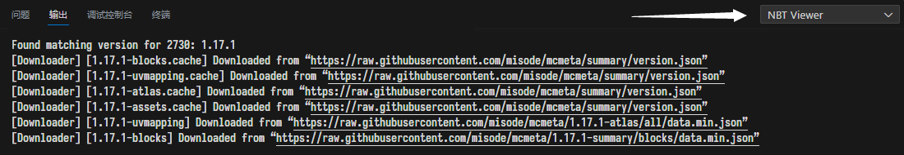

目前该扩展支持读取的文件类型：

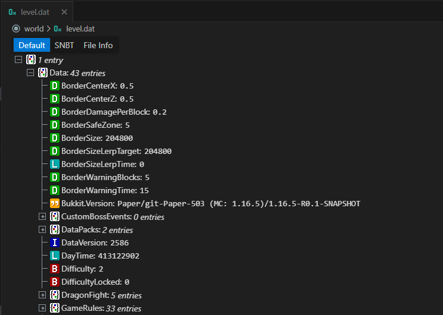

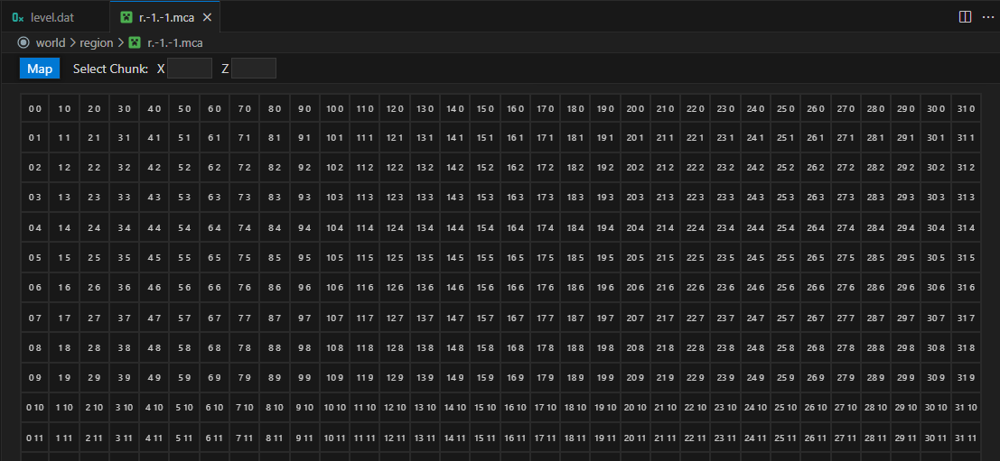

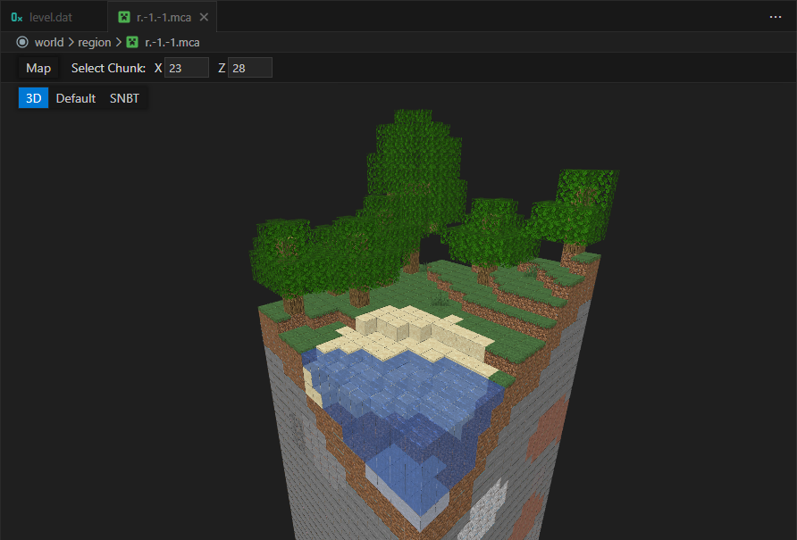

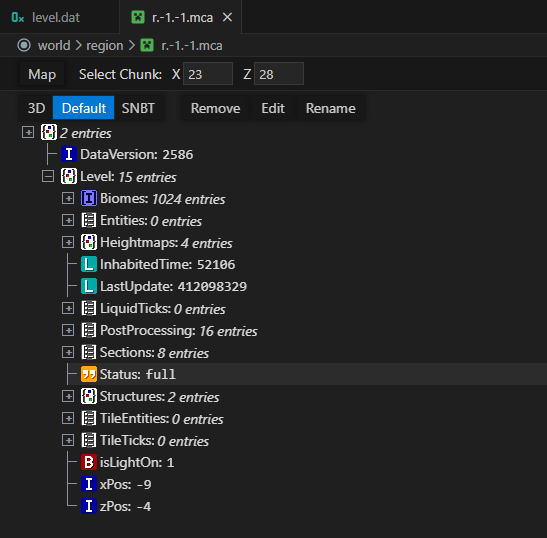

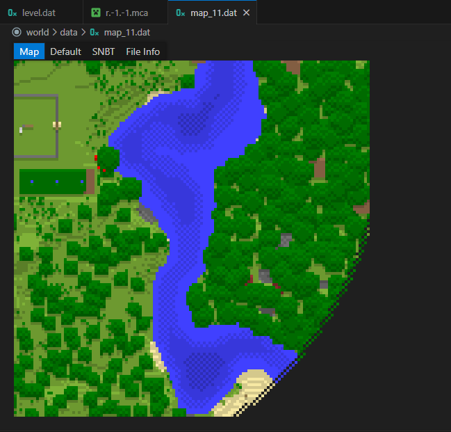

## 常见问题

### VSCode 安装包下载太慢

1. 在 VSCode 的下载页面根据需要点击下载按钮。  
    ​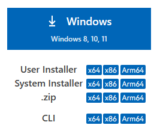
2. 等待开始下载。  
    ​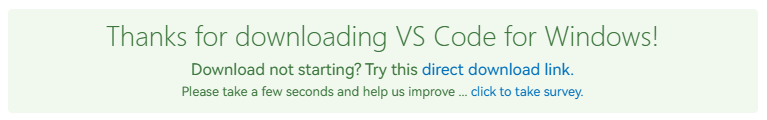
3. 打开浏览器的 “下载” 页面，复制安装包的下载链接。  
    ​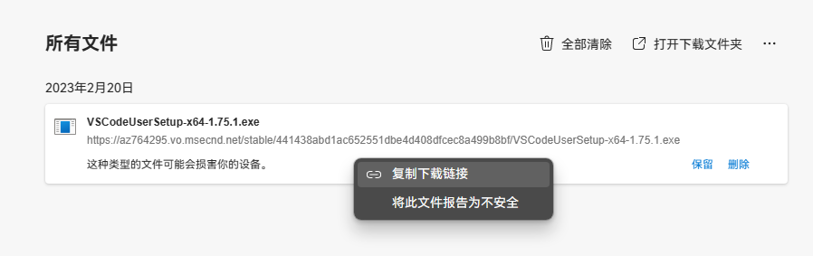
4. 将下载地址中的 `az764295.vo.msecnd.net`​ 部分替换为 `vscode.cdn.azure.cn`​，填入到浏览器的地址栏中访问，以通过国内的镜像服务器进行下载。  
    ​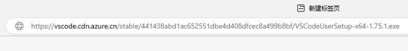  
    ​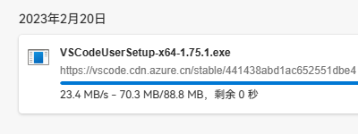

‍
