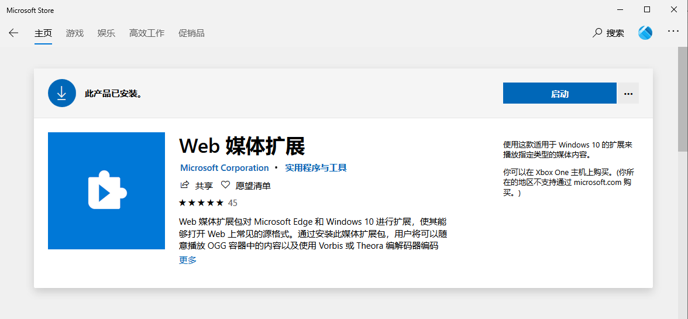
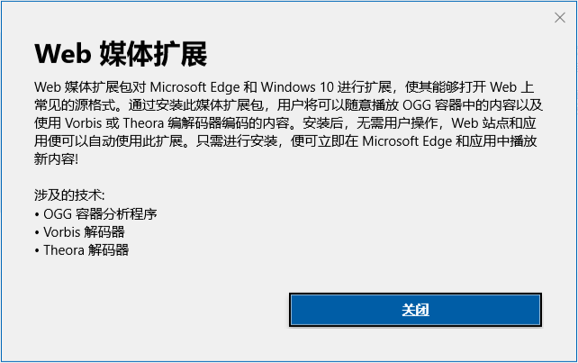
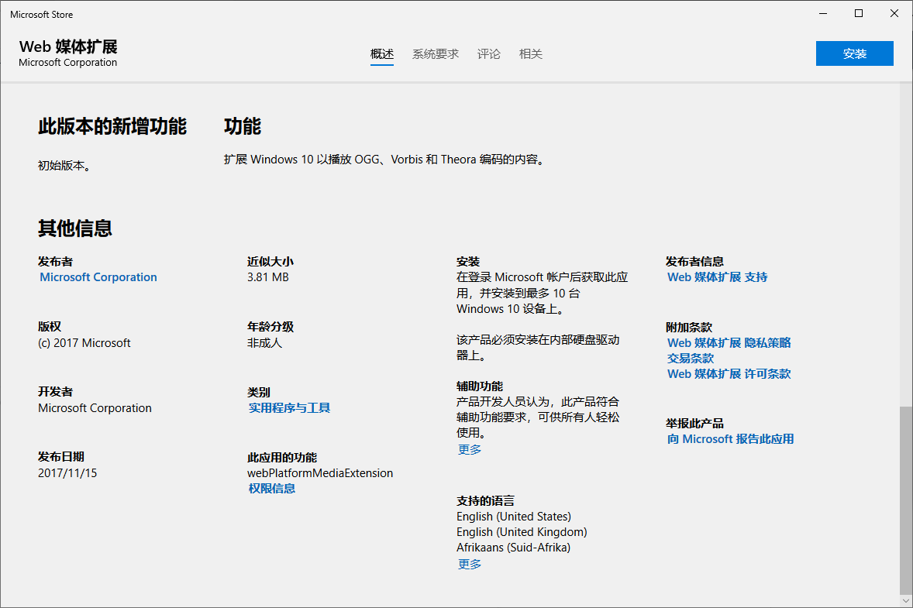

# 解决 Windows 10 资源管理器操作 OGG 文件时未响应的问题

系统版本：Windows 10 专业版 1909

---

## 简介

在 Windows 10 使用资源管理器查看、重命名、删除、移动 OGG 文件的时候会出现“未响应”的情况，要等一段时间才好。

而且，显示 OGG 文件的右键菜单时，等待时间比其他文件的要久。

## 解决方法

经过多次的安装与卸载测试，导致未响应的源头是 `Web 媒体扩展` 这个应用。

> [Web 媒体扩展包](https://www.microsoft.com/zh-cn/p/web-media-extensions/9n5tdp8vcmhs) 对 Microsoft Edge 和 Windows 10 进行扩展，使其能够打开 Web 上常见的源格式。
>
> 通过安装此媒体扩展包，用户将可以随意播放 OGG 容器中的内容以及使用 Vorbis 或 Theora 编解码器编码的内容。
>
> 安装后，无需用户操作，Web 站点和应用便可以自动使用此扩展。
>
> 只需进行安装，便可立即在 Microsoft Edge 和应用中播放新内容！

若不需要使用，可在 `Windows 设置 - 应用 - 应用和功能` 将其卸载，即可解决 OGG 文件导致资源管理器 `未响应` 的问题。

‍
