# 解决 Windows 10 提示“无法登录到你的账户”问题

## 前言

前几天，我一位朋友说登录系统之后弹出了一个 “无法登录到你的账户” 的提示框，桌面壁纸和文件变成了系统刚安装完毕的时候的状态。

看了下任务管理器，用户名变成了 “TEMP”。然后试过很多种方法：

- 根据提示重启系统，重新登录。
- 使用 “系统还原” 功能回滚到 “还原点”（无法进行，“系统还原” 功能没有开启）。
- 重启，进入安全模式登录。
- 打开注册表 `HKEY_LOCAL_MACHINE\SOFTWARE\Microsoft\Windows NT\CurrentVersion\ProfileList`，将末尾带 “.bak” 的项和不带 “.bak” 的同名项重命名互换。
- 打开注册表 `HKEY_LOCAL_MACHINE\SOFTWARE\Microsoft\Windows NT\CurrentVersion\ProfileList`，将当前用户项中的 `State` 属性值改为 `0`。

但是都没有效果，登录之后还是弹出错误提示。

之后看到官方帮助文档里说创建一个新的账户，然后把文件复制到新账户的文件夹里可以解决，就试了下（开始之前先用虚拟机测试过一次），确实有效果，而且大部分软件的数据都在（小部分保存在注册表 `HKEY_CURRENT_USER` 里的不能恢复，据说这部分数据保存在 `NTUSER.DAT`）。

## 官方帮助文档

- [Windows 错误消息：无法登录到你的帐户 - Microsoft 支持](https://support.microsoft.com/zh-cn/windows/18d55f00-a6e7-9106-29ee-54fa223c0ca8)
- [修复 Windows 中损坏的用户配置文件 - Microsoft 支持](https://support.microsoft.com/zh-cn/windows/1cf41c18-7ce3-12f9-8e1d-95896661c5c9)

## 操作步骤

> 注意：  
> 步骤与官方帮助文档中的不完全一致。  
> 对于不同的情况，该方法不一定有效。  
> 本文中的**原账户**用户名为 `my-user`，**新账户**用户名为 `temp-user`。

### 一、创建新的本地帐户并设置为管理员

1. 打开系统 “设置” 中的 “账户 - 家庭和其他用户” 页面。
2. 点击 “将其他人添加到这台电脑”，等待对话框内容加载。  
    ​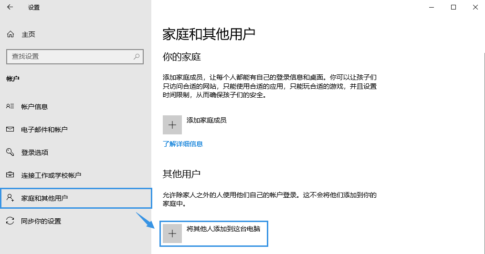
3. 点击 “我没有此人的登录信息”，然后在下一页点击 “添加一个没有 Microsoft 帐户的用户”。  
    ​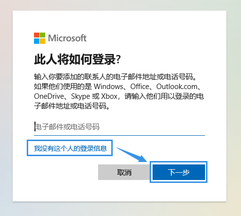  
    ​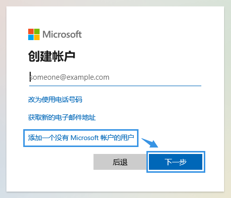
4. 根据提示，输入用户名和密码等信息（密码可以为空），然后点击 “下一步”。
5. 在账户列表中选择创建的新账户，然后点击 “更改帐户类型”。  
    ​
6. 在 “帐户类型” 中，选择 “管理员”，然后点击 “确定”。  
    ​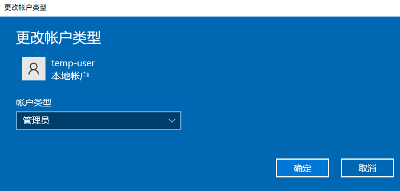
7. 重启系统，然后使用**新的管理员帐户**登录。

**注意：若原账户没有设置密码，系统启动后可能会自动登录原账户，则需要按以下步骤修改注册表。**

1. 右键任务栏中的 “Windows” 图标，点击 “运行”，输入 “regedit”，然后点击 “确定”。
2. 在注册表编辑器的地址栏中输入 `HKEY_LOCAL_MACHINE\SOFTWARE\Microsoft\Windows NT\CurrentVersion\Winlogon`，按下回车键（Enter）。
3. 双击 `DefaultUserName` 项，输入新账户的用户名，然后点击 “确定”。  
    ​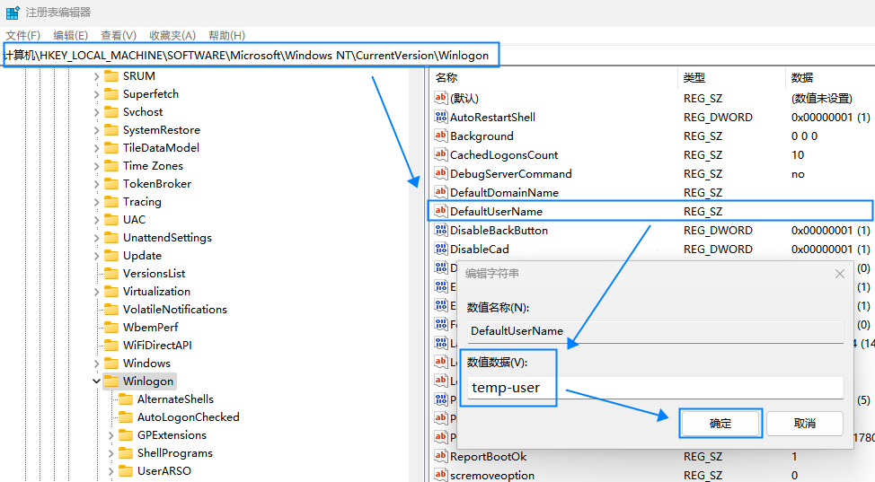
4. 关闭注册表编辑器。

### 二、将原账户的用户数据文件夹移动到其它地方

1. 打开 `C:\Users` 文件夹，右键点击名称为**原账户**用户名的文件夹，点击 “剪切”（或使用快捷键 `Ctrl + X`）。  
    ​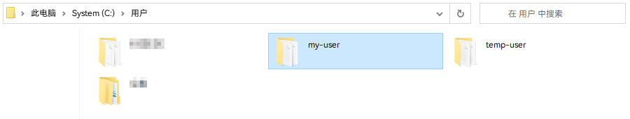
2. 打开用于放置该文件夹的目录，右键点击空白处，选择 “粘贴”（或使用快捷键 `Ctrl + V`）。  
    ​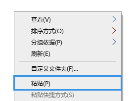  
    若提示 “你需要提供管理员权限才能移动此文件夹”，则点击 “继续”。  
    ​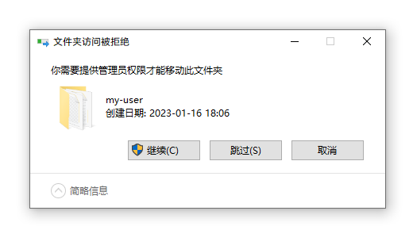

### 三、确认用户数据移动情况

1. 右键点击资源管理器左侧边栏中的 “此电脑”，选择 “属性”。  
    ​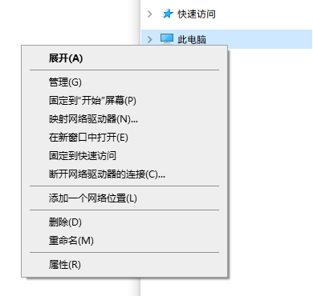
2. 在打开的 “设置” 窗口中点击 “高级系统设置”。  
    ​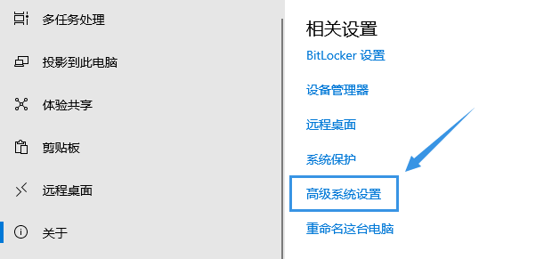
3. 切换到 “高级” 标签页，点击 “用户配置文件” 项中的 “设置”。  
    ​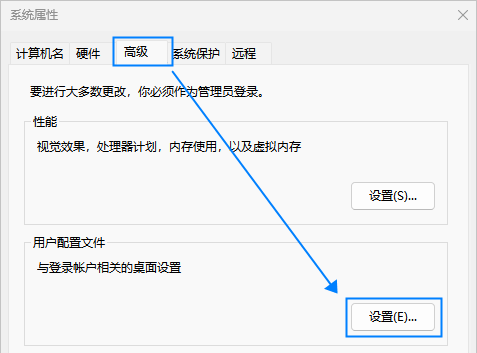
4. 正常情况下，窗口中的 “储存在本机上的配置文件” 列表不包含原账户的信息。  
    ​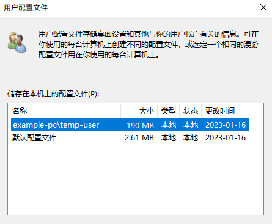
5. 关闭 “用户配置文件” 和 “系统属性” 窗口。

### 四、删除原账户，然后重新创建

> 后来用虚拟机测试过发现如果不重新创建账户，还是会弹出 “无法登录到你的账户” 提示。

1. 打开系统 “设置” 中的 “账户 - 家庭和其他用户” 页面。
2. 在账户列表中选择**原账户**，然后点击 “删除”。
3. 点击 “将其他人添加到这台电脑”，等待对话框内容加载。
4. 点击 “我没有此人的登录信息”，然后在下一页点击 “添加一个没有 Microsoft 帐户的用户”。
5. 根据提示，输入用户名和密码等信息（密码可以为空），然后点击 “下一步”。

    > 注意：用户名必须与原来保持一致，否则一些使用绝对路径读写用户数据的软件可能会出现异常。
    >
6. 在账户列表中选择创建的账户（**以下仍称为 “原账户”** ），然后点击 “更改帐户类型”。
7. 在 “帐户类型” 中，选择 “管理员”，然后点击 “确定”。

### 五、登录原账户进行初始化

1. 右键任务栏中的 “Windows” 图标，选择 “关机或注销”，点击 “注销”。  
    ​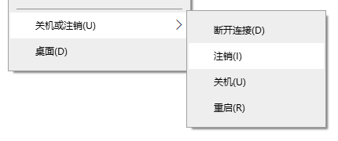
2. 登录**原账户**，等待初始化，并根据提示进行相关设置。
3. 重启系统，再次登录**原账户**（若系统自动登录了新账户，则需要先 “注销” 再切换到原账户）。

**注意：正常情况下，由于原账户的数据已重置，此时登录原账户不会弹出 “无法登录到你的账户” 提示。若仍然弹出该提示，则表示该错误是系统问题导致，无法通过该方法解决。**

### 六、登录新账户，还原原账户的数据

1. 重启系统，登录**新账户**（确保系统启动后初次登录的是**新账户**）。
2. 打开资源管理器，在 “显示 / 隐藏” 中勾选 “隐藏的项目”。  
    ​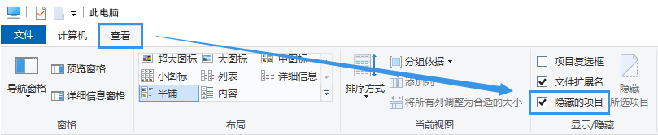
3. 打开 `C:\Users` 文件夹，进入名称为**原账户**用户名的文件夹（以下称为 `user_data`）。  
    若提示 “你当前无权限访问该文件夹。单击‘继续’获取永久访问该文件夹的权限。”，则点击 “是”。  
    ​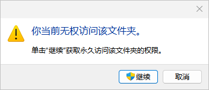
4. 打开 “第二步” 中移动的用户数据文件夹（以下称为 `backup_data`）。
5. 将 `backup_data` 中的文件夹和文件依次移动到 `user_data` 中。  
    **注意**  
    不需要移动文件名以 `ntuser` 或 `NTUSER` 开头的文件。  
    ​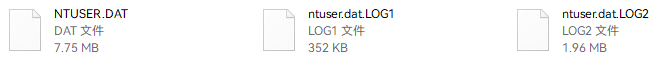  
    不需要移动图标左下角带箭头的隐藏文件夹。  
    ​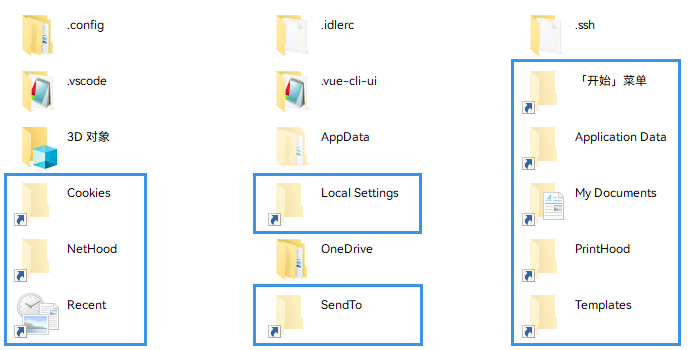  
    移动文件夹前需要先把 `user_data` 中对应的文件夹删除。  
    若文件夹中没有实际的文件，可以不移动。  
    ​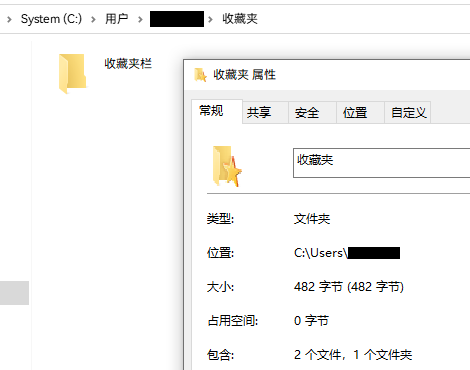

### 七、登录原账户，验证结果

1. 右键任务栏中的 “Windows” 图标，选择 “关机或注销”，点击 “注销”。  
    ​
2. 登录**原账户**。
3. 若系统不再弹出 “无法登录到你的账户”，则表示成功。

### 八、删除新账户

1. 打开系统 “设置” 中的 “账户 - 家庭和其他用户” 页面。
2. 在账户列表中选择**新账户**，然后点击 “删除”。  
    ​

‍
