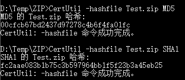
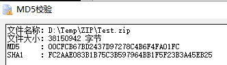

# Windows 通过命令提示符校验文件（MD5、SHA1等）

用到的命令：CertUtil

已测试系统：Windows 7、Windows 10、Windows Server 2012 R2

---

## 使用方法

### 命令

```plaintext
CertUtil -hashfile 文件路径 [算法]
```

### 使用举例

校验 `当前路径` 下的 `Test.zip` 的 MD5

```plaintext
CertUtil -hashfile Test.zip MD5
```

校验 `D:\Temp\ZIP\Test.zip` 的 SHA1

```plaintext
CertUtil -hashfile "D:\Temp\ZIP\Test.zip" SHA1
```

### 使用截图

  
​

### 支持的算法

- MD2
- MD4
- MD5
- SHA1
- SHA256
- SHA384
- SHA512

‍
