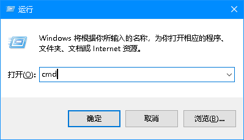
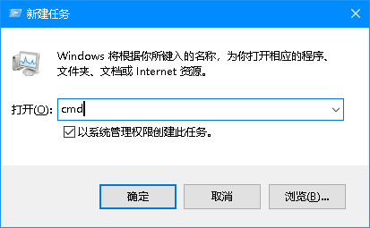
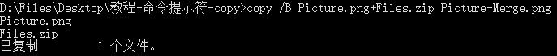
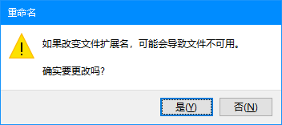
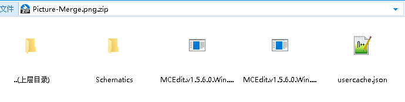
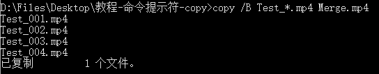

# Windows copy 命令的妙用（文件里藏文件、合并文件）

## 说明和注意事项

- ​`copy` 是一个基础的DOS命令，也许在今天已经很少有人使用，但它仍然很实用。

- 本教程基于 Windows 10 x64 专业版。

## 本教程中的命令格式

- ​`copy /B 文件名1+文件名2 合并后的文件名`
- ​`copy /B *.扩展名 合并后的文件名`

## 使用前准备

运行“命令提示符”的常用方法：同时按下 Win 键和 R 键，输入 `cmd`，按下 Enter（回车）键。

可能需要“以管理员身份运行”命令提示符，其中一种方法：

1. 右键任务栏
2. 点击任务管理器
3. 依次点击“文件”->“运行新任务”

    
4. 输入 `cmd`​，勾选“以系统管理权限创建此任务”，按下 `Enter`（回车）键

    

## 把文件藏进文件里

### 说明

根据测试，可支持把文件放入格式包括但不限于 GIF、JPG、PNG、MP3、OGG、FLV、MP4 的文件中

使用的压缩软件：2345 好压

### 步骤

1. 把要藏的文件压缩（ZIP 格式）​

    

2. 把压缩包和用于藏文件的文件放到同一文件夹

3. 使用 `cd /D` 命令 切换到第 2 步的文件夹

    例如我第2步的文件夹在 `D:\Files\Desktop\教程-命令提示符-copy`

    则执行命令 `cd /D D:\Files\Desktop\教程-命令提示符-copy`

    看到左侧显示切换后的路径则更改成功​

    

4. 使用 `copy /B` 命令 合并文件

    命令格式：`copy /B 压缩包名+用于藏文件的文件的文件名 合并后的文件名`

    文件的顺序不能错，否则合并后的文件无法正常打开

    例如我的压缩包名为 `Files.zip`​，用于藏文件的文件的文件名为 `Picture.png`

    则执行命令 `copy /B Picture.png+Files.zip Picture-Merge.png`

    

5. 若文件合并正常（达到想要的效果）则可以删除压缩包和原图片（Files.zip、Picture.png）

    注意：

    用于藏文件的文件的文件名与合并后的文件名的扩展名需要相同，但前缀名不能相同

    例如 `Picture.png`​ 与 `Picture-Merge.png`

## 提取隐藏的文件

### 步骤​

1. 右键合并后的文件，点击重命名（可以直接选中合并后的文件，按下 F2）

    

2. 在文件名后方加上 `.zip`

    例如 `Picture-Merge.png`​ 改为 `Picture-Merge.png.zip`

    

    然后双击文件，以压缩包方式打开即可​

    

## 合并分段视频

### 说明

根据测试，可支持合并格式包括但不限于 MP4、TS、M2TS 的分段视频文件。

### 步骤

1. 把视频文件放于同一文件夹内

2. 视频文件的文件名需为 `序号.扩展名`

    例如 `001.mp4 002.mp4 003.mp4 004.mp4 ......`

    序号不能错，否则合并的视频内容会出错。

3. 使用 `cd /D` 命令 切换到要第 1 步的文件夹

    例如我第 1 步的文件夹在 `D:\Files\Desktop\教程-命令提示符-copy`

    则执行命令 `cd /D D:\Files\Desktop\教程-命令提示符-copy`

    看到左侧显示切换后的路径则更改成功​

    

4. 使用 `copy /B 命令` 合并文件

    命令格式：`copy /B *.扩展名 合并后的文件名`

    例如我的分段视频文件名为 `Test_001.mp4 Test_002.mp4 Test_003.mp4 Test_004.mp4 ......`

    则执行命令 `copy /B Test_*.mp4 Merge.mp4`

    

5. 测试合并后的视频文件能否正常播放，若能正常播放，则合并成功

‍
