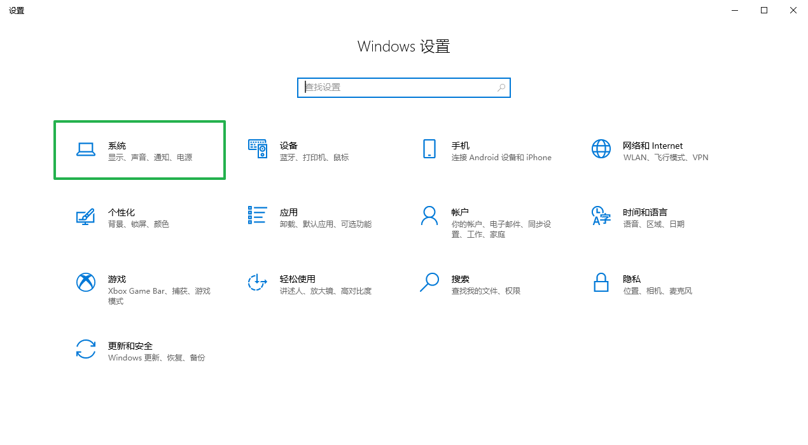
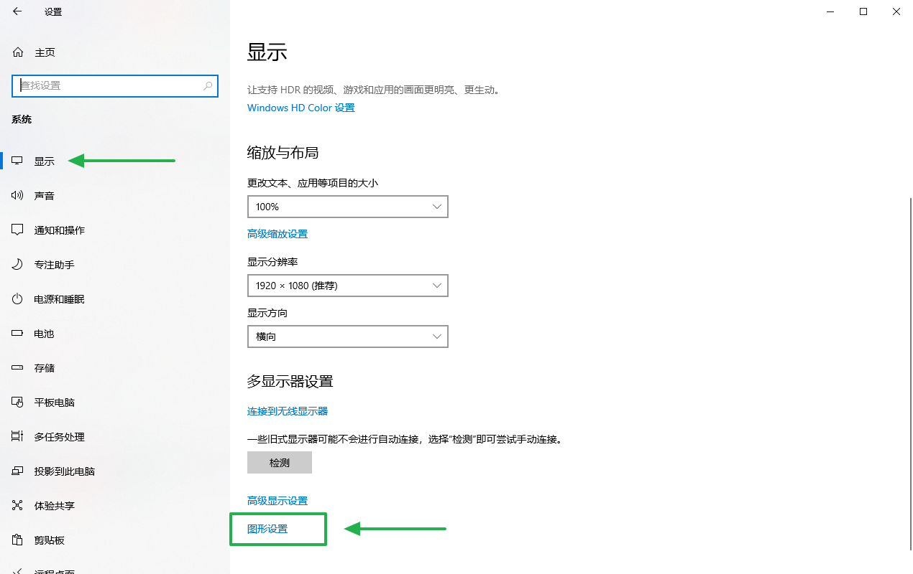
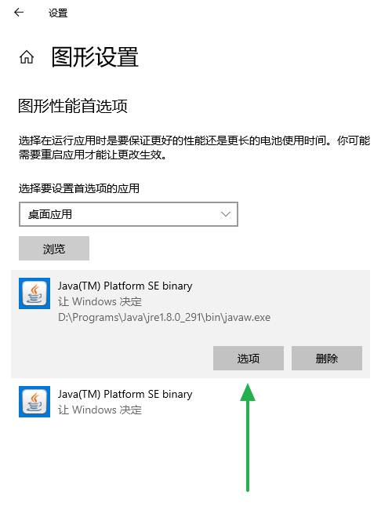
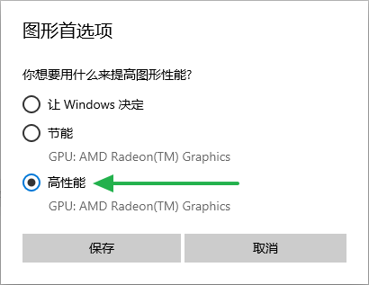

# Windows 10 设置独立显卡运行 Minecraft

## 操作步骤

1. 打开“Windows 设置”，点击“系统”。  
    ​
2. 点击“显示”选项卡下方的“图形设置”。  
    ​
3. 在“选择要设置首选项的应用”中选择“桌面应用”（一般情况下，默认为该选项），然后点击“浏览”，将 `java.exe`​ 和 `javaw.exe`​ 添加进来。  
    ​  
    ​`java.exe`​ 和 `javaw.exe`​ 在 Java 安装路径的 `bin` 文件夹中。  
    默认的 Java 安装路径的父路径为：

    ```text
    C:\Program Files\Java\
    C:\Program Files (x86)\Java\
    ```
4. 点击每一项中的“选项”，打开对应的“图形首选项”对话框。  
    ​
5. 在对话框中选择“性能”（一般情况下，该选项对应独立显卡，实际可参考下方的文本），然后点击“保存”。  
    ​

‍
