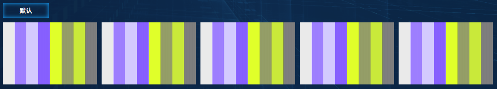
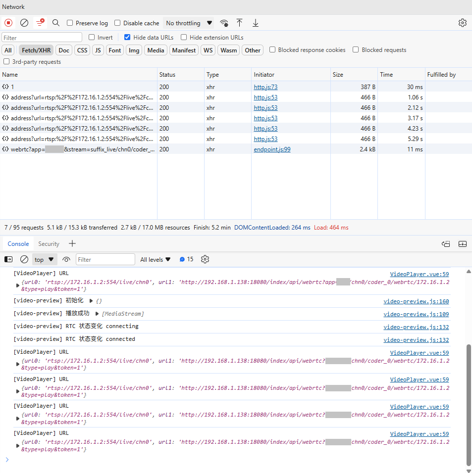
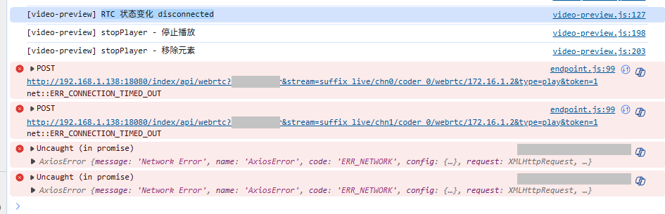
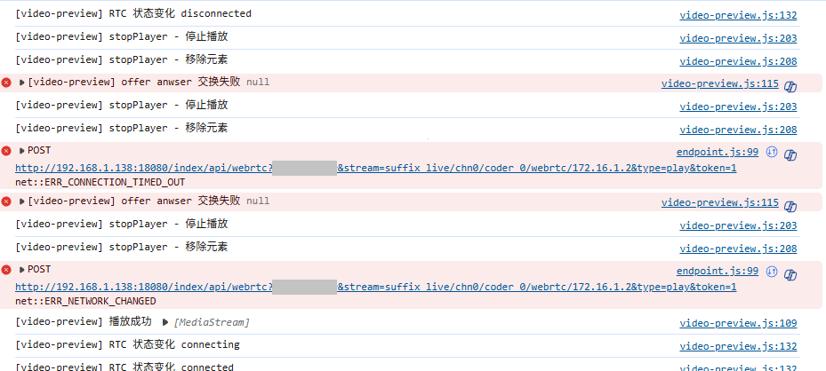
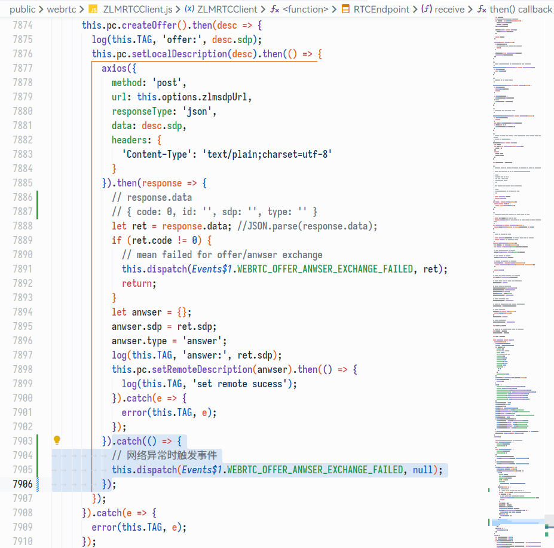
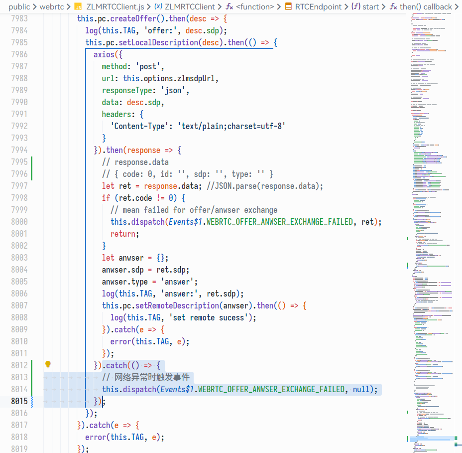

# 通过画布（Canvas）实现 ZLMRTCClient 同一视频流多次显示时只拉取一次

## 效果预览

视频画面



网络请求



## 代码实现

### ZLMRTCClient.js

> 当前使用的版本：  
> ​`1.0.1` `Mon Mar 27 2023 19:11:59 GMT+0800`​

首先需要修改 ZLMRTCClient.js 的代码，解决由于网络导致播放失败时无法触发 `WEBRTC_OFFER_ANWSER_EXCHANGE_FAILED` 事件的问题。

修改前：



修改后：



修改内容：





```javascript
// 添加 catch()
axios({
}).then(() => {
}).catch(() => {
  // 网络异常时触发事件
  this.dispatch(Events$1.WEBRTC_OFFER_ANWSER_EXCHANGE_FAILED, null);
});
```

### video-preview.js

```javascript
// 2024-05-30 初始版本
// 2024-06-06 优化视频是否存在调用检测方式
// 2025-01-08 优化逻辑，减少定时器的使用

import { v4 as uuidv4 } from 'uuid';

/**
 * @typedef  CacheItem
 * @property {string}           id         缓存项唯一 ID
 * @property {HTMLElement|null} element    Video 元素
 * @property {boolean}          isStopped  是否为主动停止播放
 * @property {ZLMPlayer|null}   player     ZLM 播放器对象
 * @property {number}           timeCheck  最后一次检测关联画布的时间戳
 * @property {number}           timeResize 最后一次更新分辨率的时间戳
 * @property {number}           timeRender 最后一次渲染的时间戳
 * @property {boolean}          willStop   是否没有关联的画布，在下一次停止播放
 */

/** @typedef {InstanceType<typeof ZLMRTCClient.Endpoint>} ZLMPlayer */

/** 检测视频是否存在调用间隔 */
const INTERVAL_CHECK_VIDEO = 10000;

/** 画布渲染间隔 */
const INTERVAL_RENDER = 100;

/** 画布分辨率更新间隔 */
const INTERVAL_RESIZE = 1000;

/** 循环处理间隔 */
const INTERVAL_TIME = 100;

/** 模块名称 */
const PREFIX = '[video-preview]';

/** 重新播放间隔 */
const RESTART_TIMEOUT = 2000;

/** ZLM 客户端 */
const ZLMRTCClient = window.ZLMRTCClient;

/** 循环检测定时器 */
let loopTimer = null;

/**
 * @desc 缓存信息列表
 * @type {Record<string, CacheItem | null>}
 */
export const cacheList = {};

/**
 * @description 初始化播放器
 * @param {string} url 视频流地址
 */
function initPlayer(url = '') {
  try {

    if (!url) {
      throw new Error('缺少 url 参数');
    }

    /**
     * @description 初始化 & 更新数据
     * @param {CacheItem} cache
     */
    let fnInit = (cache) => {

      // 创建 video 元素
      let element = document.createElement('video');

      // 开启自动播放
      // 注：不能用 `setAttribute`，否则没效果
      element.autoplay = true;
      element.controls = false;
      element.muted = true;

      // 标记缓存 ID
      element.setAttribute('data-video-id', cache.id);

      // 添加到页面，否则无法播放
      element.setAttribute('style', 'position: fixed; top: 0; left: 0; width: 0; height: 0');
      document.body.appendChild(element);

      // 初始化播放器
      let player = new ZLMRTCClient.Endpoint({
        // video 标签
        element: element,
        // 是否打印日志
        debug: false,
        // 流地址
        zlmsdpUrl: url,
        // 功能开关
        audioEnable: false,
        simulcast: false,
        useCamera: false,
        videoEnable: true,
        // 仅查看，不推流
        recvOnly: true,
        // 推流分辨率
        resolution: { w: 1280, h: 720 },
        // 文本收发
        // https://developer.mozilla.org/en-US/docs/Web/API/RTCDataChannel/send
        usedatachannel: false,
      });

      // // 监听事件：ICE 协商出错
      // player.on(ZLMRTCClient.Events.WEBRTC_ICE_CANDIDATE_ERROR, function () {
      //   console.error(PREFIX, 'ICE 协商出错')
      // });

      // 监听事件：获取到了远端流，可以播放
      player.on(ZLMRTCClient.Events.WEBRTC_ON_REMOTE_STREAMS, function (event) {
        console.log(PREFIX, '播放成功', event.streams);
      });

      // 监听事件：offer anwser 交换失败
      player.on(ZLMRTCClient.Events.WEBRTC_OFFER_ANWSER_EXCHANGE_FAILED, function (event) {

        console.error(PREFIX, 'offer anwser 交换失败', event);

        // 当前没有主动停止
        if (!cache.isStopped) {
          // 停止播放
          stopPlayer(player, element);
          // 重新播放
          setTimeout(() => {
            fnInit(cache);
          }, RESTART_TIMEOUT);
        }

      });

      // 监听事件：RTC 状态变化
      player.on(ZLMRTCClient.Events.WEBRTC_ON_CONNECTION_STATE_CHANGE, function (state) {

        console.log(PREFIX, 'RTC 状态变化', state);

        // 状态为已断开
        if (state === 'disconnected' && !cache.isStopped) {
          // 停止播放
          stopPlayer(player, element);
          // 重新播放
          setTimeout(() => {
            fnInit(cache);
          }, RESTART_TIMEOUT);
        }

      });

      cache.element = element;
      cache.player = player;

    };

    let cacheItem = cacheList[url];

    if (cacheItem) {
      return cacheItem;
    } else {
      cacheItem = {
        id: uuidv4(),
        element: null,
        isStopped: false,
        player: null,
        timeCheck: 0,
        timeRender: 0,
        timeResize: 0,
        willStop: false,
      };
    }

    console.log(PREFIX, '初始化', cacheItem);

    // 初始化
    fnInit(cacheItem);

    // 添加缓存信息
    cacheList[url] = cacheItem;

    return cacheItem;

  } catch (error) {
    console.error(PREFIX, '初始化播放器失败：');
    console.error(error);
    return null;
  }
}

/**
 * @description 停止播放
 * @param {ZLMPlayer}        player
 * @param {HTMLVideoElement} element
 */
function stopPlayer(player, element) {
  try {

    if (player) {
      console.debug(PREFIX, 'stopPlayer - 停止播放');
      player.close();
    }

    if (element instanceof HTMLVideoElement) {
      console.debug(PREFIX, 'stopPlayer - 移除元素');
      element.remove();
    }

    return true;

  } catch (error) {
    console.error(PREFIX, '停止播放失败：');
    console.error(error);
    return false;
  }
}

/**
 * @description 获取视频画面 canvas
 * @param {string} url
 */
export function getVideoCanvas(url = '') {
  try {

    if (!url) {
      throw new Error('缺少 url 参数');
    }

    let cacheItem = initPlayer(url);
    let canvas = document.createElement('canvas');

    if (cacheItem) {
      // 标记缓存 ID
      canvas.setAttribute('data-cache-id', cacheItem.id);
    } else {
      throw new Error('获取缓存数据失败');
    }

    // 背景填充
    canvas.style.backgroundPosition = 'center center';
    canvas.style.backgroundSize = '100% 100%';

    return canvas;

  } catch (error) {
    console.error(PREFIX, '获取 canvas 失败：');
    console.error(error);
    return null;
  }
}

/** 开始循环处理视频 */
export function timerStart() {
  timerStop();
  loopTimer = setInterval(() => {

    for (let url in cacheList) {

      let cacheItem = cacheList[url];
      let currTime = Date.now();

      if (!cacheItem) {
        continue;
      }

      let cacheId = cacheItem.id;
      let videoElement = cacheItem.element;

      /**
       * @desc 画布元素列表
       * @type {NodeListOf<HTMLCanvasElement>}
       */
      let canvasList = document.querySelectorAll(`[data-cache-id="${cacheId}"]`);
      let foundCanvas = canvasList.length > 0;

      // 渲染画面
      if (currTime - cacheItem.timeRender >= INTERVAL_RENDER) {
        cacheItem.timeRender = currTime;
        canvasList.forEach((canvas) => {

          let ctx = canvas.getContext('2d');
          let cWidth = canvas.width;
          let cHeight = canvas.height;

          if (document.contains(videoElement)) {
            ctx.drawImage(videoElement, 0, 0, cWidth, cHeight);
          }

          canvas.style.backgroundImage = '';

        });
      }

      // 更新画布分辨率
      if (currTime - cacheItem.timeResize >= INTERVAL_RESIZE) {
        cacheItem.timeResize = currTime;
        canvasList.forEach((canvas) => {

          let parent = canvas.parentElement;
          let rect = parent ? parent.getBoundingClientRect() : null;

          if (rect) {

            let cWidth = Math.round(canvas.width);
            let cHeight = Math.round(canvas.height);

            let rWidth = Math.round(rect.width);
            let rHeight = Math.round(rect.height);

            if (cWidth !== rWidth || cHeight !== rHeight) {
              // 更新画布分辨率前将画面设置为背景，防止闪烁
              canvas.style.backgroundImage = `url(${canvas.toDataURL('image/png')})`;
              // 更新画布分辨率（将会自动清空画布内容）
              canvas.width = rWidth;
              canvas.height = rHeight;
            }

          }

        });
      }

      // 检测是否存在与视频关联的画布
      if (currTime - cacheItem.timeCheck >= INTERVAL_CHECK_VIDEO) {

        cacheItem.timeCheck = currTime;

        // 当前存在关联的画布，不处理
        if (foundCanvas) {
          cacheItem.willStop = false;
          return;
        }

        // 若当前不存在关联的画布，检测上一次的查找结果
        if (cacheItem.willStop) {
          console.debug(PREFIX, '视频没有被调用，停止播放', { url });
          cacheItem.isStopped = true;
          stopPlayer(cacheItem.player, cacheItem.element);
          cacheList[url] = null;
        } else {
          cacheItem.willStop = true;
        }

      }

    }

  }, INTERVAL_TIME);
}

/** 停止循环处理视频 */
export function timerStop() {
  if (loopTimer) {
    clearInterval(loopTimer);
    loopTimer = null;
  }
}
JAVASCRIPT 折叠 复制 全屏
```

使用时只需要调用 `getVideoCanvas()` 获取 `canvas`，然后插入到 DOM 即可，画布会自适应父元素宽高。
